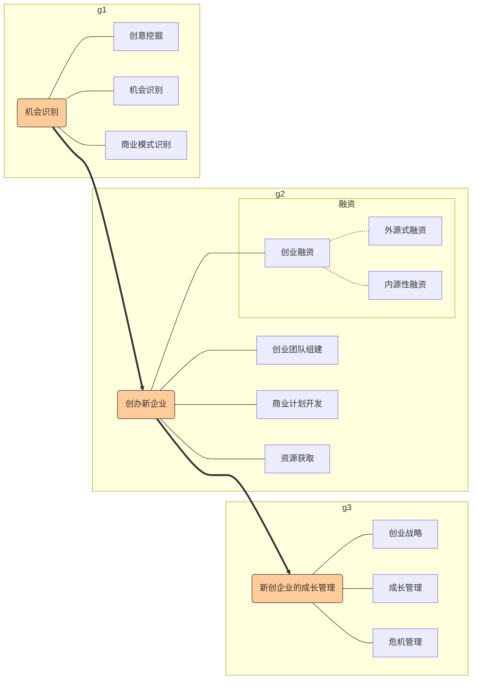
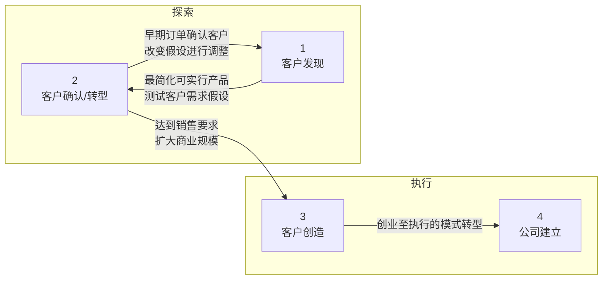
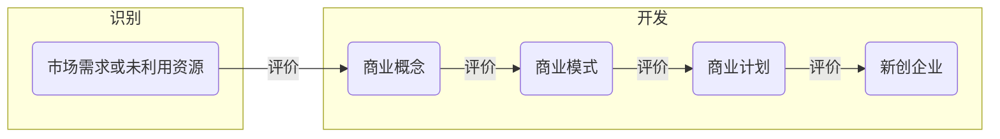
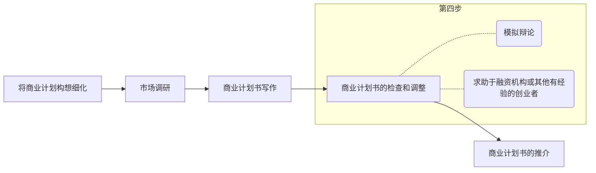

[TOC]

# 绪论

## 一、创业的理想和现实

创业理想背后是我们所谓的**创业动机**。创业理想又可分为多种类型。

1. 志存高远，以企业上市为目标，以推出改变人们日常生活和工作方式、改变世界的产品和服务作为努力的方向，期待实现财务自由的同时，让世界更美好，还能够功成名就，甚至能够影响世界。
2. 虽然有一些闲钱，但不甘一生平庸，转而将创业作为实现自己想法和价值的途径，更多地去追求个人成就感的满足。
3. 希望通过创业给自己争取更多的自由空间和选择权，摆脱每天朝九晚五的上班族生活。

## 二、创业决策的模型

创业决策分析的**蝴蝶模型**P3图，包括以下至少四个方面：

- 创业者的个性和动机
- 创业者的知识、能力、经验、资源和网络
- 创业机会的潜在价值
- 创业者的学习意愿和能力

## 三、创业过程的三要素

Timmons模型：**机会**、**资源**和**创业团队**是创业过程中最重要的驱动要素。

创业团队的执行力，一方面取决于创业团队的组成，另一方面取决于创业企业的制度安排。

创业企业的制度安排又可分为三个层次：

- 治理层面，主要为股权和控制权的配置
- 日常管理制度层面
- 非正式的制度安排以及文化氛围

## 四、创业失败的内外部因素

创业成功是难以复制的；但创业失败却是有规律可循的，可以通过学习避免和克服。

- **外部因素**：
  - 制度环境
  - 宏观经济环境
  - 技术创新的周期
  - 行业的成长性
  - 特定区域的创业环境政策
  - 运气
- **内部因素**
  - 企业的价值创造力和制度安排

## 五、创业学习的关键

中国的创业活动在全球中处于相对活跃状态；中国的创业机会较多，国民的创业动机较强，但创业能力相对不足，亟需通过创业教育和实践智慧的积累提高创业能力。

# 第1章 创业与创业精神

## 1.1创业的概念和类型

概念：

- 狭义的创业：创建新企业
- 广义的创业：一种管理风格，“不考虑现有资源的限制，去追寻机会”。

创业的**本质**：有价值的机会与具有创业精神的人之间的结合，创业是一个过程。

**创业与创新关系**：既有所交叉，又有所区别
P10韦恩图

新技术的重要性越大、突破性创新程度越大、专利保护的范围越大，该技术通过创建新企业来实现商业化的可能性越大。☛技术商业化 in university and research institutions

创业的分类：从产品/服务和市场两个维度对创业进行分类，每个维度分为成熟和新兴两类。

> |      |   新兴   |     Ⅲ     |    Ⅳ     |
> | ---: | :------: | :-------: | :------: |
> | 市场 | **成熟** |   **Ⅰ**   |  **Ⅱ**   |
> |      |          | **成熟**  | **新兴** |
> |      |          | 产品/服务 |          |

P11图

## 1.2 创业、创业精神与经济增长

19世纪中后期的美国：“管理资本主义”时代。规模成为整个时代的主旋律，大规模生产以大规模销售为前提，大规模销售以大规模消费为前提。在这种增长模式下，诞生了一批以**规模**为竞争导向的企业。企业围绕扩大规模组织实施企业行为。一方面，为获得成本优势，<u>对生产技术进行投资</u>，或者直接通过<u>横向并购</u>获得技术；另一方面，充分利用闲置产能，通过多元化方式进入相关市场。

20世纪末的美国，技术革命催生了一批具有创新和创业精神的企业。将创新和创业作为企业的常态而非起点。连企业并购也不再是围绕扩大生产规模和市场范围，而是更多希望通过并购获取<u>技术与专利、领先的用户、创新的思想与创业的团队</u>，并保持自己的创新能力与创业精神，以捍卫其在市场中的竞争地位。**创新和创业**取代了规模成为新经济增长的主旋律。

创业活跃程度比较高的国家，特别是机会型创业活跃的国家（如中、英、加、以等），经济增长率和就业率也较高；创业活跃度比较低的（如丹麦、芬兰、法、日），经济增长率和就业率也较低。（长三角、珠三角与东北、海南等）

**创业精神和创业活动对微观主体的影响**主要集中在三个方面：

1. 产生了大量的<u>中小型企业</u>，为<u>经济总量和就业</u>做出了巨大的贡献（中小型，经济，就业）
2. 活跃的创业活动催生出一批<u>高成长性的创新型创业企业</u>，成为国家经济的中流砥柱（高成长性企业，中流砥柱）
3. 一些<u>成熟的企业</u>也凭借创业活动和创业精神<u>获得了新生</u>。（成熟企业，新生）【3M公司、苹果、华润公司、中粮集团】

> GFM中国研究报告，2014年，我国创业活动指数高于（美、英、德、日等）发达国家。

新创企业对经济的贡献不仅仅体现在其总量对经济和就业的帮助。许多创业活动直接<u>诞生</u>的是对国家经济命脉有着重要影响的<u>世界级企业</u>。这些翘楚企业，不仅为社会提供了大量的<u>投资和就业机会</u>，同时也带动了<u>上下游企业</u><u>派生出</u>大量的<u>新创企业和创业活动</u>。

中国的许多成熟企业也通过投资企业内部或外部的创业活动获得了增长。（华润、中粮）

## 1.3 创业精神与社会发展

人类进入机器大工业社会最伟大的发明之一就是大企业、大组织的社会存在方式。但在专业化分工和组织规模极大地提升了社会产出效率的过程中，人类自身感受到的幸福感并没有对得到同样的提高。在一定意义上，它反而称为禁锢人类自由、压抑人类天性、掠夺人类天赋的经济怪兽。（大企业、大组织➡个人不幸福）

在企业获得利润的同时，能否同时帮助人类获得心灵的解放和个性的张扬，是工业社会永远无法回答的问题。

创新精神和创业活动确实在方方面面影响着我们的社会。

1. 创业精神和创业活动的兴起<u>将“**人**”推向了整个社会发展的中心</u>。
   - 创业和创业活动更依赖于人的创造性和主动性，使整个社会更加关注人的发展。
     <u>企业中的角色</u>基本可以简化为**股东**、**管理者**和**一般性员工**。
   - **工资**是连接企业和个人的重要纽带，也是企业与个人之间的矛盾焦点。企业总是偏向于低估人的价值，员工则往往愿意高估自己对企业的贡献。
   - 工业社会的企业管理模型对于创业型社会来说落伍了。创业活动使企业工作的重点必须从对人的管理，转移到对人类潜质的开发；从强调员工的服从，转移到鼓励员工创新；从强调企业文化对人的影响，转移到帮助人类获得心智的模式转变。创业和创业活动首先承认**人的天赋和能力**，社会和企业需要做的就是发掘与充分利用人的这种能力与天赋。
2. 创业活动将使人们能够逐渐从工作本身获得**满足感和成就感**。因为
   - 创业活动往往能够将<u>工作过程与工作成果</u>之间的<u>联系</u>体现得更加清晰。
   - **多样化的工作**给创业活动的参与者以更大的幸福感。（创业活动的参与者总是承担多种任务和角色，经常变化，“干中学”）
   - 激发了员工的创造性，学习成为满足人们好奇心和解决问题的手段。
3. 创业活动充分保障了**社会**良好的**流动性**。
   - **外部契约**替代了身份成为了社会的主要特征。
   - 在打破身份对社会流动的阻碍之后，资本对知识的雇佣成为阻碍人们进一步纵向流动的要素。➡“富不过三代”（有效途径：社会总体创新精神和创业活动的增强）

## 1.4 创业环境

GEM研究将影响创业活动的环境条件分为一般环境条件和创业环境条件（也称为“创业生态系统”）。

【中国优势使用***加粗斜体***
	中国劣势使用<u>下划线</u>】

- 一般环境条件：**不直接**对创业活动产生影响，而主要作用域创业的环境要素进而影响创业活动。
  - 国家的对外开放程度
  - 政府职能
  - 企业管理水平和技能
  - 技术研发水平和程度
  - ***基础设施***
  - 资本市场
  - 劳动力市场
  - 制度完善程度等
- 创业环境条件（11个）
  - <u>创业融资</u>
  - ***政府政策***（关注最多，分歧：政府干预 or 自由经济体系）
    - 【中国举措】
      - 便利的工商登记服务
      - 推进知识产权保护和交易，全国知识产权运营公共服务平台
      - 完善创业板，推动新三板和区域股权交易中心的建设
      - 落实扶持小微企业发展的税收优惠政策，科技企业孵化器、大学科技园、研发费用加计扣除、固定资产加速折旧
  - 税收和行政体制
  - <u>政府项目支持</u>
  - <u>在校创业教育和培训</u>
  - <u>离校创业教育和培训</u>
  - <u>研究与开发效率</u>【PS: 事实上劣势处写的是研究开发转移】
  - 商业与法律基础设施
  - ***国内市场动态性***
  - ***有形*** 与服务的***基础设施***
  - ***文化和社会规范***

还有三个**宏观环境因素**将会在未来十年中高度影响中国创业活动的数量和质量：

1. 整体经济的增长态势及增长方式转变（经济高速增长->区域不平衡、低于差异性->细分市场	转变	经济增速放缓，新常态->“创业、协调、绿色、开放、共享”五大发展理念->挑战与机会）
2. 全球化浪潮与互联网经济
   - 一方面，互联网经济催生出大量的创业机会
   - 另一方面，全球化浪潮使许多创业活动一开始就是全球化的模式。
3. 部分政策性垄断产业的进一步放开
   - 城市燃气、水务系统、电信、城市快递等在内的多个政策性垄断产业

## 1.5 创业教育

创业教育在机会识别、创业融资、创业企业的成长管理等方面确实能够为创业者带来一定的指导和借鉴。所以许多国家纷纷将创业教育纳入社会教育体系。

美国：创业课程、创业实验室、孵化器等、创业研究会哦创业（教育）中心。创业学科是美国大学中获得社会捐资的讲席教授席位最多的三个学科领域之一。

中国：高校自主探索->教育部有计划在部分高校试点->全面纳入课程体系和学生培养计划。
本科生和研究生：基础创业课程和创业计划活动
MBA：案例教学、创业实习、创业模拟

人力资本是推动新时代经济社会发展的关键要素。创新创业教育的**本质意义**在于<u>激发人的主动性和创造</u>性，提升（潜在）创业者的认知水平和创新创业技能，培养企业家精神和团队精神。

创新创业教育，最重要的是**培养“人”**，而不能简单片面地强调培养项目和孵化企业。

## 本章小结

本章介绍了创业精神和创业活动对经济增长、社会发展的作用，并对影响创业活动的环境要素进行了讨论。本章害介绍了国内外创业教育的发展和现状。

## 复习与讨论课

1. 对比过去20年间美国、日本和中国的创业活动，分析其对国家经济和社会发展的作用。
2. 观察你身边的3位创业者，列举出他们所显现的可以通过教育或者其他方式传递的特质，同时也列举出你认为无法通过教育方式传递的特质。
   - 可以传递：战略眼光、领导力、沟通能力、变革管理
   - 不能传递：
3. 你认为创业活动会通过哪些方式影响经济增长和社会发展？
   - 中小企业，经济总量，就业
   - 高成长性创新型创业企业，中流砥柱
   - 成熟企业，获得新生
   - 诞生世界级企业，不仅为社会提供大量投资和就业机会，也带动了上下游产业派生出大量新创企业和创业活动。

# 第2章 创业过程

## 2.1 理解创业的一般过程

**创业过程**：创业者<u>发现和评估商机</u>，并且将商机转化为创业者对新创企业进行成长管理的过程。

在这一过程中，新创企业的<u>组织创建和发展</u>是主要企业管理的**关键**。

和一般的企业管理的区别：前者涵盖的时间更为漫长，设计的因素也更为复杂，因而更具<u>挑战性</u>和<u>诱惑性</u>。

完整的创业过程：

1. 机会识别

   - 创意挖掘（不确定性、市场前景未知）
     **创意**是创业者进入创业的**起点**。
   - 机会识别
     机会是创意的一个<u>子集</u>
     机会拥有大多数创意不具备的一个重要特征：能满足顾客的某些需求，因而**具备市场价值**。
   - 商业模式设计
     机会不能脱离必要的商业模式的支撑而独立存在。

2. 创办新企业

   1. 组建创业团队

      良好的创业团队是创建新企业的**基本前提**。

   2. 开发商业计划

      成功的商业计划是创建新企业的**良好开端**。

   3. 创业融资

      融资是新创企业的**首要问题**。

      融资方式：

      - 内源式融资：在创业团队内部融资

        - 创业者个人投资

        - 家庭成员投资

          优点：成本低，资金渠道简单，容易操作

          缺点：融资量有限

      - 外源式融资：从企业外部获得资金

        - 债务融资

        - 股权融资

          优点：大大拓宽新创企业的融资范围

          缺点：增加融资成本，必须适当放弃某些权益以获得这些资金。

3. 新创企业的成长管理

   1. 战略管理

      企业战略是企业行动的**纲领**，是企业发展的方向性定位。战略是企业管理的首要问题。

      新创企业战略管理的**重点**在于<u>战略位置的确立与战略资源的获取</u>。

      抓住自己和市场上已有企业的差异做文章，形成自己独特的竞争优势，发展核心竞争力。

   2. 成长管理

      创业企业能否实现可持续成长，<u>企业领导人</u>是关键因素。

   3. 危机管理

      被模仿是普遍面临的挑战。

## 2.2 新创企业的生命周期

分为种子期、初创期、发展期和成熟期

1. 种子期：仍然是创意或者机会，只是几个志同道合的创业者组成创业团队，进行研究开发和前期准备
   <u>新企业的建立</u>，标志着创业者成功地度过种子期。
2. 初创期：新产品雏形已经产生，组织架构（简单）初步形成
   初创期是创业过程中的第一个富有挑战的时期。只有<u>赢得足够顾客</u>才能进入下一个阶段。
3. 发展期：初步摆脱生存困扰，开始考虑盈利。
   下一步要持续<u>创新</u>，应对新的竞争者。<u>建立合理的管理制度</u>应对企业的扩张。
4. 成熟期
   出现阻碍创新的惰性和障碍。
   思考如何保持企业的竞争力。
   进行多元化经营管理是创业者面临的主要问题。

## 2.3 创业中所需的资源

种类：

- 要素资源（直接参与企业日常生产、经营活动的资源）
  - 场地
  - 资金
  - 人才
  - 管理
  - 科技
- 环境资源（未直接参与企业生产，但其存在可以极大地提高企业运营的有效性资源）
  - 政策
  - 信息
  - 文化（硅谷）
  - 品牌

## 2.4 精益创业的理念和思维

精益创业的**核心思想**是先在市场中投入一个最简化可行产品，然后通过不断的学习和有价值的用户反馈，对产品进行快速迭代优化，以期适应市场。

两个阶段：探索（<u>验证性学习</u>：客户发现->客户确认/转型）和执行（客户创造->公司建立）

## 2.5 三个重要的创业模型

1. Timmons创业模型

   **核心**思想在于创业过程是一个高度的<u>动态过程</u>，其中**商机、资源、创业团队**是创业过程中最重要的驱动因素，它们的存在和变化，决定了创业过程向什么方向发展；而这三个要素是动态演变的，创业领导人要努力寻找这三者之间的适合和平衡。
   成功的创业企业更应着眼于最小化使用资源并控制资源，而不是贪图完全拥有资源。要竭力设计精巧的创意、用尽谨慎的战略。

2. Sahlman创业模型

   要把握**四个关键要素**：<u>人、机会、外部环境</u>以及<u>创业者的交易行为</u>。

   **核心**思想是<u>要素之间的适应性</u>，也就是人、机会、交易行为以及外部环境能否协调整合，共同促进创业的成功。

3. 创业行动模型

   **两大挑战**：

   - 如何提高组织的<u>效率</u>，以提高其竞争力

   - 如何获取和管理组织的<u>正当性</u>（合法性），使组织能够被大家所接受->“新进入者劣势”

     创业企业获取正当性的三种战略

     - **杠杆**：杠杆利用正当性的现有来源
     - **协调**：将创业行动与现有的制度规则和规范密切协调
     - **制定**：促使制度环境重新定义正当性

## 本章小结

创业的一般过程是对创业管理活动的概括，本章对创业过程的组成和各阶段的不同特点进行了归纳，着有利于创业者或者投资者对于创业过程的复杂性和艰巨性的基本了解；本章还运用了企业生命周期理论对创业过程进行了梳理，以加深读者对创业过程的认识。本章还阐释了创业过程中所需的各种资源，这些资源是创业成长的各类生产要素和支持条件，在创业过程中，创业者要对创业资源进行组织和整合。本章还介绍了精益创业的理念和思维。最后，简要地介绍了三个重要的创业模型。

## 复习与讨论题

1. 创业过程通常由几个阶段组成，每个阶段创业者需要注意哪些主要问题？

2. 创业资源与一般企业所需要的资源有什么联系和区别？列举你觉得最重要的三项创业资源并给予解释。

   1. 场地资金人才管理科技
   2. 政策信息文化品牌

3. 调研几个创业案例，用Timmons模型或者Salhman模型来解释这些新创企业的发展过程。

4. 对创业企业进行访谈，调研其创业过程中的主要创业行为，了解正当性对创业企业获取资源的影响，并调研创业企业是如何获取和管理正当性的。

   杠杆、协调、制定

# 第3章 创业机会

## 3.1 创业机会：概念和存在的原因

Timmons认为，创业过程的**核心**是<u>创业机会</u>问题，创业过程是由机会驱动的技术进步、政府管制政策发生变化、国际化的发展……这些变化都会带来机会。

在产品市场的创业活动有三大类机会：

1. 由于新技术的产生，创造新信息
2. 由于时间和空间的原因导致信息不对称而引起市场无效，利用市场失灵
3. 当政策、管制和人口统计特征发生重要变化，与资源利用相关的成本和利益便会发生转变，这些转变可能创造机会。

创业机会**概念**：新的生产方式、新的产出或新的生产方式与产出之间的关系形成过程中，引进新的产品、服务、原材料和组织方式，得到比生产成本更高价值的情形。

创业机会->商业概念->商业模式

创业机会存在的**原因**：

1. 经验解释（一些创业学研究者对已有的机会进行分析，然后加以总结，这样的解释是经验主义的）

   - 法规的变化
   - 巨大的行业变化
   - 价值链和分销渠道的重构
   - 知识产权的优势
   - 现有的人员、资本和管理不当
   - 创业精神
   - 市场领导者不能满足或漠视顾客的需要

2. 福利经济学解释

   不能实现<u>帕累托最优</u>就是市场的失灵和失败，那么就存在创业机会以实现潜在的帕累托改进。

   导致市场失灵的主要原因：信息不完全，垄断力量，公共产品，外部性和政府不适当的干预——这些原因引起交易障碍，也正是创业机会存在的原因。

   创业机会**来源**：

   1. 发现和利用机会
   2. 打破垄断
   3. 提高公共产品的私有化程度
   4. 创造外部性的市场

3. 基于非均衡理论的解释

   <u>人们对资源价值的判断不同</u>是创业机会出现的**必要条件**。

   1. 现有的价格不能完全反映于资源有关的信息。
   2. 未来的信息无法完全还原到现有的价格信息上。
   3. 创业决策并不都是最优决策。
   4. 创业决策不能实施反映资源的生产力，不能自动实现变更。

   人们对资源的价值有不同判断的原因：

   1. 市场决策过程要求参与者猜测其他人的期望，人们的决策是建立在运气、直觉、探索和准确或不准确的信息基础之上的，这使决策常常不正确。由于决策并不总是正确的，这个过程就会导致错误，使资源的短缺、过剩和错误配置常常发生。那么就会出现一些对现有“错误”反应非常机敏的个人，他们是可以在资源价格低的地方买进、重组，然后以高价格售出。
   2. 经济运行的常态是非均衡状态。技术、政治、社会、管制以及其他变革的类型源源不断地产生新信息，为了增加财富而使用资源的不同方式的信息。由于新信息使将财富转为更有价值的形式成为可能，它改变了资源的价值，因此也改变了资源的均衡价格。因此信息的分布是不完全的，所有的经济主体不能同时获得新信息。所以，有些人在其他人之前了解到关于资源、新发现或新市场的信息。先行获得信息的经济主体可以低于均衡价值的价格买到资源，然后重组、出售，赚取创业利润。

   创业机会出现，至少要求创业者与资源所有者和其他创业者的价值判断不同。

4. 基于社会学理论的解释

   制度既会对创业者的机会识别产生重大影响，也会影响创业者如何去开发创业机会；反过来，创业者的创业行动可能会对制度产生影响，保活产生新的商业实践、新的组织类型和新的制度结构，出现所谓的制度创业和制度创业者。

   创业者和制度环境相互作用。

## 3.2 创业机会的期望价值：选择利于创业的机会

平均来看，创业者只开发那些期望价值较高的机会。

影响产业，决定其是否适合创业企业的生存的因素：

1. 知识因素：一个产业生产产品或提供服务所需要的知识情况，主要指生产过程的复杂程度、产业创造新知识的水平，创新单位的规模和不确定性的程度。
   1. <u>研究与开发密集</u>的产业
   2. 技术创新的来源主要是<u>公共部门</u>而不是私人部门
   3. <u>较小规模</u>的单位即可实施技术创新的产业
2. 需求因素
   1. <u>市场规模</u>：大
   2. <u>市场成长性</u>：快速
   3. <u>市场的细分情况</u>：明确
3. 产业生命周期
   1. <u>产业成长期</u>比产业衰老期更适宜创业企业的生存。而且越是在产业发展初期，新企业越容易进入。
   2. 产业进入成熟期的标志是出现了**通行标准**。<u>通行标准出现前</u>比通行标准出现后更适宜创业企业的生存。
4. 产业结构
   1. 资本密集程度：低
   2. 规模经济：效应不显著
   3. 产业集中程度：市场份额不集中
   4. 以<u>中小企业为主</u>的产业适合新企业的生存。

产生创业机会之窗（P71图）的**原因**：

1. 新技术的出现（通信、互联网、交通方式的变化)
2. 产业结构的变化（电子商务与零售百货）
3. 政策、管制的改变
4. 社会、人口统计特征的变化（城乡结构、老龄人口比重）

存在机会之窗现象的原因：

1. 一些因不均衡冲击产生的机会常常被其他冲击带来的新机会所取代，而现有机会就会消失
2. 即使没有产生新的冲击，竞争也会耗尽机会的利润。
3. 信息的扩散和利润诱惑的减少，将降低人们追求某具体机会的动力。

决定机会之窗周期长短的因素：

1. 限制其他创业者模仿的机制（商业秘密、专利保护或垄断合同）
2. 减缓信息扩散速度或他人在认识信息方面存在时滞
3. 如果其他人无法模仿、替代或获得稀有的资源

提前预测和判断“机会之窗”的**核心**一点是<u>寻找</u>那些<u>产业发展“瓶颈”的价值链环节</u>。

机会的类型：市场需求是否已知/资源和能力是否确定
P76图

## 3.3 创业机会评价

阶段性决策方法：得到普遍使用、可以适应很多情况；要求创业者在机会开发的每个阶段都要进行机会评价
识别过程使创业企业家在开发过程中的每一阶段都要放弃一些机会（认识到的社会需求和未利用资源的数量要远远超过成功形成的企业的数量）

影响机会评价标准的四个重要因素：

1. 创业经历（首次创业->过度自信）
2. 行业经验
3. 管理经验
4. 行业的新兴程度

| Timmons机会评价框架    |                                                              |
| ---------------------- | ------------------------------------------------------------ |
| 行业与市场             | 1.市场已被识别，可以带来持续收入 2.顾客可以接受产品或服务，愿意为此付费 3.产品的附加价值高 4.产品对市场的影响力高 5.将要开发的产品生命长久 6.项目所在的行业是新兴行业，竞争不完善 7.市场规模大，销售潜力达到1k万~10亿元 8.市场成长率在30%~50%甚至更高 9.现有厂商的生产能力几乎完全饱和 10.在五年内能占据市场的领导地位，达到20%以上 11.拥有低成本的供货商，具有成本优势 |
| 经济因素               | 1.达到盈亏平衡点所需要的时间在1.5~2年以下 2.盈亏平衡点不会逐渐提高 3.投资回报率在25%以上 4.项目对资金的要求不是很大，能够获得融资 5.销售额的年增长率高于15% 6.有良好的现金流量，能占到销售额的20%~30%甚至更高 7.能获得持久的毛利，毛利率要达到40%以上 8.能获得持久的税后利润，税后利润率要超过10% 9.资产集中程度低 10.运营资金不多，需求量是逐渐增加的 11.研究开发工作对资金的要求不高 |
| 收获条件               | 1.项目带来附加价值的具有较高的战略意义 2.存在现有的或可预料的退出方式 3.资本市场环境有利，可以实现资本的流动 |
| 竞争优势               | 1.固定成本和可变成本低 2.对成本、价格和销售的控制较高 3.已经获得或可以获得对专利所有权的保护 4.竞争对手尚未觉醒，竞争较弱 5.拥有专利或某种独占性 6.拥有良好的网络关系，容易获得合同 7.拥有杰出的关键人员和管理团队 |
| 管理团队               | 1.创业者团队是一个优秀管理者的组合 2.行业和技术经验达到了本行业内的最好水平 3.管理团队的正直廉洁程度能达到最高水准 4.管理团队知道自己缺乏哪方面的知识 |
| 致命缺陷               | 不存在任何致命缺陷                                           |
| 创业家的个人标准       | 1.个人目标与创业活动相符合 2.创业家可以做到在有限的风险下实现成功 3.创业家能接受薪水减少等损失 4.创业家渴望进行创业这种生活方式，而不只是为了赚大钱 5.创业家可以接受适当的风险 6.创业家在压力下状态依然良好 |
| 理想与现实的战略性差异 | 1.理想与现实情况相吻合 2.管理团队已经是最好的 3.在客户服务管理方面有很好的服务理念 4.所创办的事业顺应时代潮流 5.所采取的技术具有突破性，不存在许多替代品或竞争对手 6.具备灵活的适应能力，能快速地进行取舍 7.始终在寻找新的机会 8.定价与市场领先者几乎持平 9.能够获得销售渠道，或已经拥有现成的网络 10.能够允许失败 |

## 3.4 创业机会识别与开发

三个过程：

1. 感知：感觉到或认识到市场需求和/或未得到充分利用的资源
2. 发现：识别或发现特定市场需求和专门资源间的配合
   <u>前提条件</u>是这些需求和资源可能在一个尚未运转的企业实现匹配。
3. 创造：以商业概念等形式创造一个独立的需求与资源间的新的配合
   商业概念创造包括资源的重组和重新定位

创业者的重要资源：

1. 人力资本：正相关，<u>非正式教育</u>影响更大
2. 机会识别能力
3. 社会资本：涉及主体从社会结构、网络和成员关系中获取利益的能力
   弱关系比强关系更为重要，因为弱关系能够把不同的圈子连接起来，社会关系才得以形成一个大网，否则仅仅是一个个“孤岛”，这就形成“复杂网络中，强关系带来资源，弱关系带来机会”。

## 本章小结

创业过程的**核心**是<u>创业机会</u>，创业过程是由机会驱动的技术进步，创业机会并不简单等同于新产品、新服务、新原材料和新的组织方式。创业机会是将资源创造性地整合，通过市场需求（或性取、愿望）分析预测，传递实现价值的可能性。经济的不均衡是常态，创业机会的存在也是常态。从非均衡理论的角度可以比较全面深入地分析创业机会的存在。

实践证明，创业者只开发那些期望价值较高的机会。本章第二节从机会存在的产业、机会存在的时间和机会的类型三个方面讨论什么样的机会是期望价值高、利于创业的。创业机会能否从最初的市场需求和未利用资源的形态发展成为新企业，不仅涉及机会本身的情况，还要求机会能与创建新企业的其他力量（创业团队、投资人等）相协调。

为了分析、评价创业机会，本章第三节详细讨论了Timmons的评价框架，其中涉及八大类53项指标。现实中有成千上万适合创业者的特定机会，但未必都能与这个评价框架相契合。但Timmons的理论框架仍然是目前包含评价指标比较完全的一个体系。

不过，应该明确认识的是，创业机会的识别、评级和利用是创业者个人的个性、能力、资源等情况与创业机会本身相互作用的过程。本章第四节进一步讨论了创业机会识别与开发的过程。

## 思考题

1. 讨论创业机会的静态概念和动态概念的区别和联系
   1. 静态概念
2. 分析互联网创业浪潮中取得成功的一些创业者，探讨：
   1. 他们曾经面临哪些主要的机会？请列举你认为最重要的3个。
   2. 帮助他们取得创业成功的核心因素有哪些？
   3. 他们之间共性的特点有哪些？
3. 在当前“大众创业、万众创新”新形势下，国家出台了一系列支持创新和创业的政策，请结合你感兴趣的领域或行业，分析其中会出现什么样的创业机会？你认为创业者需要在哪些方面做准备，才能抓住这样的创业机会？

# 第4章 商业模式

## 4.1 商业模式的概念

商业模式定义：

1. 7W（when,where,why,how,how much地为who提供what），并开发资源以持续这种努力的组
2. 企业盈利所需采用的核心业务决策与平衡
3. 通俗：描述企业如何通过运作来实现其生存于发展的故事

商业模式的核心三要素：顾客、价值和利润

## 4.2 商业模式的作用

一个好的商业模式本身具有非常重要的商业价值：

1. 可以促使创业者缜密地思考市场需求、生产、分销、企业能力、成本结构等各方面的问题，将商业的所有元素协调成一个有效、契合的整体
2. 可以让顾客清晰了解企业可能提供的产品和服务，实现企业在顾客心目中的目标定位
3. 可以让企业员工全面理解企业的目标和价值所在
4. 可以让股东更清晰、方便地判断企业的价值及其在市场中的地位变化

商业模式的逻辑主线：价值的创造、传递、分享

商业模式在整个创业过程中起着承前启后的作用。

企业提供的核心价值：产品、价格、渠道、服务和体验

商业模式和创业战略的关系：既有区别又有联系

1. 商业模式更多考察由建立和运营企业所必须的各个环节紧密构成的完整要素链。
2. 创业战略则在于规划一条从创业机会、组织资源通向创业目标的道路，它必须充分考虑竞争因素。
3. 都派生于共同的市场机会，服务于共同的企业目标。

## 4.3 商业模式的评价

商业模式的四个核心内容：

1. 收入来源
2. 成本的主要构成
3. 所需要的投资额
4. 关键的成功要素

商业模式是否具有合理性，是企业能否成功的基本条件。

商业模式合理性的基本检验方法：

1. 逻辑检验
2. 数字检验

商业模式优劣评价的3S原则：

1. 简明
2. 可扩展
3. 可持续

国内成功的商业模式的常见类型：

1. 复制
2. 替代
3. 革命性创新

## 4.4 商业模式的演进和持续创新

商业模式的出现和普及，与整个社会的相关基础设施、具体的技术创新前几期应用范围密切相关

商业模式：从模糊到清晰，从“复制”到“本土化”（考虑消费文化上的差异）

与专注于降低成本的方式相比，通过改善商业模式对提高企业在行业中的地位效果更为显著。

创业者的核心作用在于实现生产要素的新组合；创新主要表现在以下五个方面：

1. 开发新的产品
2. 开发新的生产程序
3. 采用新的组织方式
4. 开辟新的市场
5. 采用新的原材料

## 本章小结

商业模式是创业中非常重要的一个概念。本章首先介绍了商业模式的概念，探讨了商业模式的核心三要素，即顾客定位、价值创造和利润来源；其次分析了商业模式自身的商业价值和商业模式在创业过程中的重要作用，并探讨了商业模式和战略的关系，再次介绍了商业模式合理性的两种基本检验方法，即逻辑检验和数字检验；提出了评价商业模式的3S原则；最后分析了商业模式的演进和持续创新，指出创业企业的商业模式存在着一个从模糊到清晰的过程，即使是复制国外或其他地区成功的商业模式，也需要进行合礼的“本土化”，并指出任何一个企业，都必须适时地对其商业模式进行持续的创新，才能实现长盛不衰。

## 复习与讨论题

1. 基于商业模式的核心三要素，对近3年来在纳斯达克和深圳创业板成功上市的代表性中国企业的商业模式分别进行具体分析。
2. 结合你感兴趣的行业，搜寻过去几年失败的1~2家典型创业企业案例并进行分析，探讨该企业在商业模式上的缺陷。
3. 对中国开展共享单车业务的不同创业企业的商业模式和竞争战略进行比较分析，并预测各自的发展前景。
4. 与不同创业阶段的创业者进行交流，了解其商业模式是如何形成和调整的。

# 第5章 创业者与创业团队

## 5.1 创业者心理及性格特质

1. 胸有抱负、目标明确
2. 富有创新、自我激励
3. 自信乐观、百折不挠
   1. 自信与理性
   2. 百折不挠
   3. 挑战不确定性
   4. 评估并理性承担风险
   5. 在失败中学习，在困境中成长
4. 团队精神、善于学习
5. 诚实正直、精力充沛

## 5.2 创业者应具备的个人能力

1. 建立创业文化的技能
   1. 人际沟通和团队工作的技能
   2. 领导技能
   3. 帮助、督导和矛盾管理技能
   4. 团队工作和人员管理技能
2. 管理或技术才能
   1. 两大跨职能领域
      1. 行政管理
         1. 解决问题
         2. 沟通
         3. 计划
         4. 决策
         5. 项目管理
         6. 谈判
         7. 管理外部专业人才
         8. 人事管理
      2. 法律税收
         1. 公司法和证券法
         2. 合同法
         3. 有关专利和所有者权力的法律
         4. 税法
         5. 破产法
   2. 四大关键职能领域
      1. 市场营销
         1. 市场研究和评估
         2. 市场营销计划
         3. 产品定价
         4. 销售管理
         5. 服务管理
         6. 产品管理
         7. 新产品开发计划
      2. 金融
      3. 生产运营
         1. 生产管理
         2. 库存控制
         3. 成本分析和控制
         4. 质量控制
         5. 生产日程表和生产流
         6. 购买
         7. 工作评估
      4. 财务
         1. 筹集资金
         2. 管理现金流
         3. 信用和托收
         4. 短期融资方式
         5. 公开发行和私募资金
         6. 簿记、会计和控制
         7. 其他的特定技能
   3. 技术管理

## 5.3 创业团队的组建

概念：

1. 狭义的创业团队是指有着共同目的、共享创业收益、共担创业风险的一群经营新成立的营销性组织的人，即<u>企业的共同创始人</u>。
2. 相对广义的创业团队是指<u>共同创始人和早期重要员工。</u>
3. 更加广义的创业团队不仅包含<u>共同创始人和早期重要员工</u>，还包括与<u>创业过程有关的各种利益相关人</u>，如风险投资商、供应商、专家咨询群体等。

创业团队的组建方式：

1. 相似性
2. 互补性
3. 渐进性
4. 动态性

不适合组建创业团队的人选：

1. 长远目标分歧
2. 投机
3. 完美主义
4. 极端独立
5. 平等注意
6. 追求所谓“梦幻组合”

成功团队的理念：

1. 凝聚力
2. 合作精神
3. 完整性
4. 长远目标
5. 对收获的看法
6. 致力于价值创造
7. 平等中的不平等
8. 公正性
9. 共同分享收获

## 5.4 创业团队的股权分配和激励

股权分配的**核心问题**是：<u>剩余索取权和控制权的配置</u>

企业共同创始人之间股权分配的**基本依据**是每个创始人对创业企业的<u>贡献度、重要度</u>和他所承担的<u>风险</u>（包括创业所放弃的机会成本和创业资金投入等）。

雁行股权结构模式

创业团队**激励**的**原则**：物质激励与精神激励相结合原则、正激励与负激励相结合原则、内在激励与外在激励相结合原则、按需激励原则、组织目标与个人目标相结合原则、严格管理与思想工作相结合原则

对于高新技术创业企业，**人力资本**是其发展的关键要素。

合理分配报酬：

1. 形成分享财富的理念
2. 综合考虑企业与个人目标
3. 规范制定报酬制度的程序
4. 实施合理分配方案（体现差异化、注重业绩、充分考虑灵活性）
5. 综合考虑分配时机和手段
6. 适时采用股票托管协议

股票期权计划：

1. 股票期权计划（美国，在授予期结束后才能行权，授权时间表）
   1. 激励股票期权（有更大的税收优惠，更具吸引力）
   2. 非法定股票期权
2. 准股票期权计划（中国）

团队成员绩效评价：

1. 创业思路
2. 商业计划准备
3. 敬业精神和风险
4. 工作经验、技能、业绩记录或社会关系
5. 岗位职责

## 本章小结

本章阐述了创业者的定义及其演变过程，以期读者充分了解创业者在变化的环境中具有的个性特征及心理特征；本章介绍了创业者应具有的个人能力，重点考虑创建企业文化的能力以及管理和技术等方面的能力；本章给出了创业团队具有不同层面上的定义，新创企业在组建团队的时候应该注意补缺性、渐进性和动态性，并充分了解团队成功建设时需要具备的条件；本章分析了创业团队的股权分配和激励，探讨了在创业全过程中如何考虑对团队成员的激励、创业团队在不同阶段采取不同的激励手段和激励措施。

## 复习与讨论题

1. 如何理解创业者？你认为自己要成为成功的创业者，还需要在哪些方面锻炼和提高？
2. 举例说明创业者的个性特征和能力对企业的影响。
3. 你认为在创建创业团队的时候应该注意哪些方面的问题？如何解决团队成员的稳定性和流动性矛盾？
4. 当团队成员对企业目标的理解出现分歧时，如何保障团队的凝聚力？
5. 如何结合创业团队的实际涉及合理的激励机制和报酬体系？

# 第6章 商业计划

## 6.1 商业计划

概念：

1. 广义：对企业活动进行详尽的、全方位的筹划，从企业内部的人员、制度、管理以及企业的产品、营销和市场等各个方面展开分析。
2. 狭义：创业的商业计划，向投资方和创业投资者说明公司未来发展战略与实施计划balabalabala

好的商业计划要从三个方面考虑问题：市场、投资者和创业者本身。

商业计划具有“**计划**”和“**营销**”两大功能。

**为什么**要有商业计划书？

1. 创业融资：<u>商业计划书的质量</u>，往往决定着企业融资的成败。一份优秀的商业计划正是创业者吸引<u>融资</u>的“敲门砖”和“通行证”。
2. 认识自己：编写商业计划的过程也是企业<u>认识自己</u>的过程。
3. 战略思考：商业计划建立在详尽的分析基础之上，这不仅可以大大节省时间和减轻以后的压力，还有助于<u>战略思考</u>。
4. 创建和凝聚团队：商业计划是创业团队沟通的“语言”和凝聚团队力量的重要手段。
5. 取得政府和相关机构支持

吸引风险投资商的商业计划：产业和市场、产品和技术、风险和盈利、管理和组织及竞争战略等问题进行重点描述，并对资金需求、资金使用、回报和推出措施等加以说明，力求吸引投资者的眼球。

吸引合伙人的商业计划：还需说明合伙人的出资方式以及利益分享机制

获取政府或公共部门支持的商业计划：创业活动的经济和社会意义，希望给予的具体支持

## 6.2 如何制定商业计划书

商业计划书是个实时文件，必须随着企业的发展不断进行完善和修改，甚至完全的颠覆。

写作步骤：

商业计划书的六大要素：

1. 商业模式
2. 市场
3. 产品（服务）
4. 竞争
5. 管理团队
6. 行动

商业计划书的基本要求：力求准确、简明扼要、条理清晰、诸种语言、强调可信性

## 6.3 商业计划书的主要内容

结构与格式

1. 封面或封页
2. 内容索引和目录
3. 摘要
   1. 最好在最后完成摘要部分
   2. 针对性
   3. 文笔生动，开门见山
   4. 反复检查，防错别字等
4. 企业介绍
   1. 一般描述
   2. 业务性质
   3. 业务发展历史
   4. 业务展望
   5. 公司组织架构：所有制性质和附属关系
   6. 营销
   7. 供应商
   8. 专利与商标
5. 产品（服务）
   1. 简要介绍
   2. 产品（服务）价格
   3. 独特性
   4. 顾客或买主
6. 技术和研发
   1. 未来技术发展趋势
   2. 公司的技术研发力量
   3. 研发计划
   4. 知识产权保护
7. 管理团队和组织：“一流的管理团队+二流的产品（服务）”>"二流的管理团队+一流的产品（服务）"
   1. 管理层的展示：责任划分、业绩、互补性、优秀品质职业道德
   2. 创业所需要的支持和服务：顾问名单
   3. 激励约束机制
   4. 组织模式和组织结构
8. 市场分析：商业计划书的两大功能都要以市场分析为基础
   1. 产业分析
   2. 目标顾客
   3. 竞争分析
9. 营销计划
   1. 总体营销战略（企业定位+4P+4P未能覆盖内容）
   2. ”4P“
      1. **产品战略**（营销“4P”的<u>第一要素</u>）
      2. **定价战略**
      3. **渠道战略**
      4. **促销战略**
   3. 销售目标和战略实施
10. 生产计划：生产资源、生产过程、生产目标
11. 财务计划：商业计划的核心和灵魂
    1. 财务报表
    2. 财务预测
    3. 融资计划
12. 风险管理
13. 退出策略：公开上市（不畅通）、兼并收购、回购等

## 6.4 商业计划书中的一些常见问题

执行总结太长

过分强调基数

缺乏市场分析和竞争对手分析

过于乐观，对风险及相应对策考虑不足

## 本章小结

对创业者来说，商业计划在融资和计划方面具有重要的作用。本章向读者描述了商业计划的全貌。首先，创业者应了解商业计划的目标 ——融资和行动计划，对此，创业者不仅需要分析自己，还要关注读者——风险投资者；其次，结合对商业计划内容的揭示，本章说明了创业者该如何思考，商业计划的读者关心哪些内容，存在着哪些细节问题，如何写作，等待。另外，由于商业计划会涉及很多更专业的技术问题，读一些参考书是必要的。

## 复习与讨论题

1. 商业计划的构成框架及其关键要素包括哪些？
   1. 关键要素：商业模式、市场、产品（服务）、竞争、管理团队、行动
   2. 构成框架
      1. 封面或封页
      2. 内容索引和目录
      3. 摘要
      4. 企业介绍
      5. 产品（服务）
      6. 技术
      7. 管理团队和组织
      8. 市场分析
      9. 营销计划
      10. 生产计划
      11. 财务计划
      12. 风险管理
      13. 退出策略
2. 对于不同发展阶段、不同行业的创业企业，商业计划在写作上应该有哪些侧重？
   1. 不同发展阶段：
      1. 种子期：突出核心技术
      2. 成长期和发展阶段：侧重市场定位和市场营销
      3. 成熟公司内部的公司创业：注重与整体战略的协调
3. 阅读几个商业计划的案例，比较他们的异同，脚裂它们的不同侧重并理解其原因。