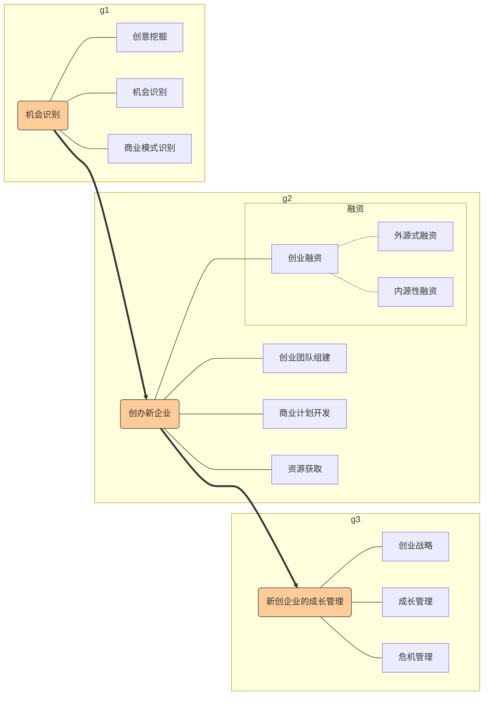
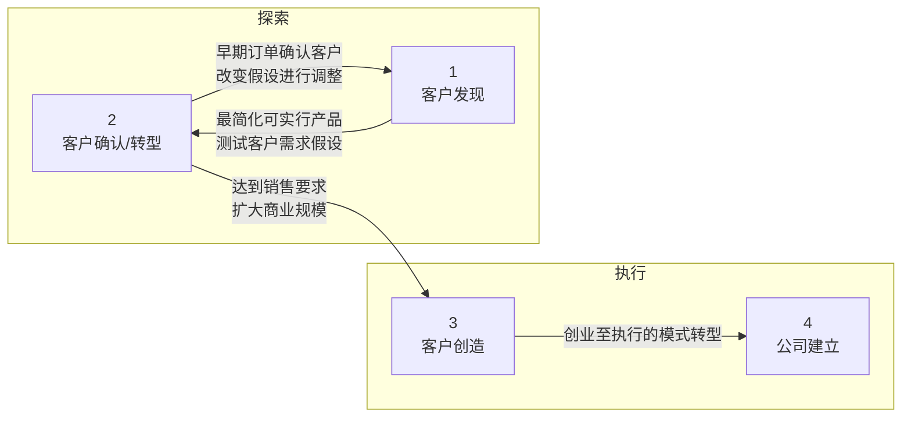

# 第2章 创业过程

## 2.1 理解创业的一般过程

**创业过程**：创业者<u>发现和评估商机</u>，并且将商机转化为创业者对新创企业进行成长管理的过程。

在这一过程中，新创企业的<u>组织创建和发展</u>是主要企业管理的**关键**。

和一般的企业管理的区别：前者涵盖的时间更为漫长，设计的因素也更为复杂，因而更具<u>挑战性</u>和<u>诱惑性</u>。

完整的创业过程：

1. 机会识别

   - 创意挖掘（不确定性、市场前景未知）
     **创意**是创业者进入创业的**起点**。
   - 机会识别
     机会是创意的一个<u>子集</u>
     机会拥有大多数创意不具备的一个重要特征：能满足顾客的某些需求，因而**具备市场价值**。
   - 商业模式设计
     机会不能脱离必要的商业模式的支撑而独立存在。

2. 创办新企业

   1. 组建创业团队

      良好的创业团队是创建新企业的**基本前提**。

   2. 开发商业计划

      成功的商业计划是创建新企业的**良好开端**。

   3. 创业融资

      融资是新创企业的**首要问题**。

      融资方式：

      - 内源式融资：在创业团队内部融资

        - 创业者个人投资

        - 家庭成员投资

          优点：成本低，资金渠道简单，容易操作

          缺点：融资量有限

      - 外源式融资：从企业外部获得资金

        - 债务融资

        - 股权融资

          优点：大大拓宽新创企业的融资范围

          缺点：增加融资成本，必须适当放弃某些权益以获得这些资金。

3. 新创企业的成长管理

   1. 战略管理

      企业战略是企业行动的**纲领**，是企业发展的方向性定位。战略是企业管理的首要问题。

      新创企业战略管理的**重点**在于战略位置的确立与战略资源的获取。

      抓住自己和市场上已有企业的差异做文章，形成自己独特的竞争优势，发展核心竞争力。

   2. 成长管理

      创业企业能否实现可持续成长，<u>企业领导人</u>是关键因素。

   3. 危机管理

      被模仿是普遍面临的挑战。

## 2.2 新创企业的生命周期

分为种子期、初创期、发展期和成熟期

1. 种子期：仍然是创意或者机会，只是几个志同道合的创业者组成创业团队，进行研究开发和前期准备
   <u>新企业的建立</u>，标志着创业者成功地度过种子期。
2. 初创期：新产品雏形已经产生，组织架构（简单）初步形成
   初创期是创业过程中的第一个富有挑战的时期。只有<u>赢得足够顾客</u>才能进入下一个阶段。
3. 发展期：初步摆脱生存困扰，开始考虑盈利。
   下一步要持续<u>创新</u>，应对新的竞争者。<u>建立合理的管理制度</u>应对企业的扩张。
4. 成熟期
   出现阻碍创新的惰性和障碍。
   思考如何保持企业的竞争力。
   进行多元化经营管理是创业者面临的主要问题。

## 2.3 创业中所需的资源

种类：

- 要素资源（直接参与企业日常生产、经营活动的资源）
  - 场地
  - 资金
  - 人才
  - 管理
  - 科技
- 环境资源（未直接参与企业生产，但其存在可以极大地提高企业运营的有效性资源）
  - 政策
  - 信息
  - 文化（硅谷）
  - 品牌

## 2.4 精益创业的理念和思维

精益创业的**核心思想**是先在市场中投入一个最简化可行产品，然后通过不断的学习和有价值的用户反馈，对产品进行快速迭代优化，以期适应市场。

两个阶段：探索（<u>验证性学习</u>：客户发现->客户确认/转型）和执行（客户创造->公司建立）

## 2.5 三个重要的创业模型

1. Timmons创业模型

   **核心**思想在于创业过程是一个高度的<u>动态过程</u>，其中**商机、资源、创业团队**是创业过程中最重要的驱动因素，它们的存在和变化，决定了创业过程向什么方向发展；而这三个要素是动态演变的，创业领导人要努力寻找这三者之间的适合和平衡。
   成功的创业企业更应着眼于最小化使用资源并控制资源，而不是贪图完全拥有资源。要竭力设计精巧的创意、用尽谨慎的战略。

2. Sahlman创业模型

   要把握**四个关键要素**：<u>人、机会、外部环境</u>以及<u>创业者的交易行为</u>。

   **核心**思想是<u>要素之间的适应性</u>，也就是人、机会、交易行为以及外部环境能否协调整合，共同促进创业的成功。

3. 创业行动模型

   **两大挑战**：

   - 如何提高组织的<u>效率</u>，以提高其竞争力

   - 如何获取和管理组织的<u>正当性</u>（合法性），使组织能够被大家所接受->“新进入者劣势”

     创业企业获取正当性的三种战略

     - **杠杆**：杠杆利用正当性的现有来源
     - **协调**：将创业行动与现有的制度规则和规范密切协调
     - **制定**：促使制度环境重新定义正当性

## 本章小结

创业的一般过程是对创业管理活动的概括，本章对创业过程的组成和各阶段的不同特点进行了归纳，着有利于创业者或者投资者对于创业过程的复杂性和艰巨性的基本了解；本章还运用了企业生命周期理论对创业过程进行了梳理，以加深读者对创业过程的认识。本章还阐释了创业过程中所需的各种资源，这些资源是创业成长的各类生产要素和支持条件，在创业过程中，创业者要对创业资源进行组织和整合。本章还介绍了精益创业的理念和思维。最后，简要地介绍了三个重要的创业模型。

## 复习与讨论题

1. 创业过程通常由几个阶段组成，每个阶段创业者需要注意哪些主要问题？

2. 创业资源与一般企业所需要的资源有什么联系和区别？列举你觉得最重要的三项创业资源并给予解释。

   1. 场地资金人才管理科技
   2. 政策信息文化品牌

3. 调研几个创业案例，用Timmons模型或者Salhman模型来解释这些新创企业的发展过程。

4. 对创业企业进行访谈，调研其创业过程中的主要创业行为，了解正当性对创业企业获取资源的影响，并调研创业企业是如何获取和管理正当性的。

   杠杆、协调、制定

