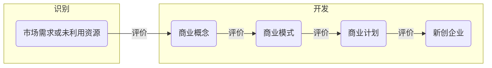

# 第3章 创业机会

## 3.1 创业机会：概念和存在的原因

Timmons认为，创业过程的**核心**是<u>创业机会</u>问题，创业过程是由机会驱动的技术进步、政府管制政策发生变化、国际化的发展……这些变化都会带来机会。

在产品市场的创业活动有三大类机会：

1. 由于新技术的产生，创造新信息
2. 由于时间和空间的原因导致信息不对称而引起市场无效，利用市场失灵
3. 当政策、管制和人口统计特征发生重要变化，与资源利用相关的成本和利益便会发生转变，这些转变可能创造机会。

创业机会**概念**：新的生产方式、新的产出或新的生产方式与产出之间的关系形成过程中，引进新的产品、服务、原材料和组织方式，得到比生产成本更高价值的情形。

创业机会->商业概念->商业模式

创业机会存在的**原因**：

1. 经验解释（一些创业学研究者对已有的机会进行分析，然后加以总结，这样的解释是经验主义的）

   - 法规的变化
   - 巨大的行业变化
   - 价值链和分销渠道的重构
   - 知识产权的优势
   - 现有的人员、资本和管理不当
   - 创业精神
   - 市场领导者不能满足或漠视顾客的需要

2. 福利经济学解释

   不能实现<u>帕累托最优</u>就是市场的失灵和失败，那么就存在创业机会以实现潜在的帕累托改进。

   导致市场失灵的主要原因：信息不完全，垄断力量，公共产品，外部性和政府不适当的干预——这些原因引起交易障碍，也正是创业机会存在的原因。

   创业机会**来源**：

   1. 发现和利用机会
   2. 打破垄断
   3. 提高公共产品的私有化程度
   4. 创造外部性的市场

3. 基于非均衡理论的解释

   <u>人们对资源价值的判断不同</u>是创业机会出现的**必要条件**。

   1. 现有的价格不能完全反映于资源有关的信息。
   2. 未来的信息无法完全还原到现有的价格信息上。
   3. 创业决策并不都是最优决策。
   4. 创业决策不能实施反映资源的生产力，不能自动实现变更。

   人们对资源的价值有不同判断的原因：

   1. 市场决策过程要求参与者猜测其他人的期望，人们的决策是建立在运气、直觉、探索和准确或不准确的信息基础之上的，这使决策常常不正确。由于决策并不总是正确的，这个过程就会导致错误，使资源的短缺、过剩和错误配置常常发生。那么就会出现一些对现有“错误”反应非常机敏的个人，他们是可以在资源价格低的地方买进、重组，然后以高价格售出。
   2. 经济运行的常态是非均衡状态。技术、政治、社会、管制以及其他变革的类型源源不断地产生新信息，为了增加财富而使用资源的不同方式的信息。由于新信息使将财富转为更有价值的形式成为可能，它改变了资源的价值，因此也改变了资源的均衡价格。因此信息的分布是不完全的，所有的经济主体不能同时获得新信息。所以，有些人在其他人之前了解到关于资源、新发现或新市场的信息。先行获得信息的经济主体可以低于均衡价值的价格买到资源，然后重组、出售，赚取创业利润。

   创业机会出现，至少要求创业者与资源所有者和其他创业者的价值判断不同。

4. 基于社会学理论的解释

   制度既会对创业者的机会识别产生重大影响，也会影响创业者如何去开发创业机会；反过来，创业者的创业行动可能会对制度产生影响，保活产生新的商业实践、新的组织类型和新的制度结构，出现所谓的制度创业和制度创业者。

   创业者和制度环境相互作用。

## 3.2 创业机会的期望价值：选择利于创业的机会

平均来看，创业者只开发那些期望价值较高的机会。

影响产业，决定其是否适合创业企业的生存的因素：

1. 知识因素：一个产业生产产品或提供服务所需要的知识情况，主要指生产过程的复杂程度、产业创造新知识的水平，创新单位的规模和不确定性的程度。
   1. <u>研究与开发密集</u>的产业
   2. 技术创新的来源主要是<u>公共部门</u>而不是私人部门
   3. <u>较小规模</u>的单位即可实施技术创新的产业
2. 需求因素
   1. <u>市场规模</u>：大
   2. <u>市场成长性</u>：快速
   3. <u>市场的细分情况</u>：明确
3. 产业生命周期
   1. <u>产业成长期</u>比产业衰老期更适宜创业企业的生存。而且越是在产业发展初期，新企业越容易进入。
   2. 产业进入成熟期的标志是出现了**通行标准**。<u>通行标准出现前</u>比通行标准出现后更适宜创业企业的生存。
4. 产业结构
   1. 资本密集程度：低
   2. 规模经济：效应不显著
   3. 产业集中程度：市场份额不集中
   4. 以<u>中小企业为主</u>的产业适合新企业的生存。

产生创业机会之窗（P71图）的**原因**：

1. 新技术的出现（通信、互联网、交通方式的变化)
2. 产业结构的变化（电子商务与零售百货）
3. 政策、管制的改变
4. 社会、人口统计特征的变化（城乡结构、老龄人口比重）

存在机会之窗现象的原因：

1. 一些因不均衡冲击产生的机会常常被其他冲击带来的新机会所取代，而现有机会就会消失
2. 即使没有产生新的冲击，竞争也会耗尽机会的利润。
3. 信息的扩散和利润诱惑的减少，将降低人们追求某具体机会的动力。

决定机会之窗周期长短的因素：

1. 限制其他创业者模仿的机制（商业秘密、专利保护或垄断合同）
2. 减缓信息扩散速度或他人在认识信息方面存在时滞
3. 如果其他人无法模仿、替代或获得稀有的资源

提前预测和判断“机会之窗”的**核心**一点是<u>寻找</u>那些<u>产业发展“瓶颈”的价值链环节</u>。

机会的类型：市场需求是否已知/资源和能力是否确定
P76图

## 3.3 创业机会评价

阶段性决策方法：得到普遍使用、可以适应很多情况；要求创业者在机会开发的每个阶段都要进行机会评价
识别过程使创业企业家在开发过程中的每一阶段都要放弃一些机会（认识到的社会需求和未利用资源的数量要远远超过成功形成的企业的数量）

影响机会评价标准的四个重要因素：

1. 创业经历（首次创业->过度自信）
2. 行业经验
3. 管理经验
4. 行业的新兴程度

|Timmons机会评价框架||
| ---------------------- | ------------------------------------------------------------ |
| 行业与市场             | 1.市场已被识别，可以带来持续收入 2.顾客可以接受产品或服务，愿意为此付费 3.产品的附加价值高 4.产品对市场的影响力高 5.将要开发的产品生命长久 6.项目所在的行业是新兴行业，竞争不完善 7.市场规模大，销售潜力达到1k万~10亿元 8.市场成长率在30%~50%甚至更高 9.现有厂商的生产能力几乎完全饱和 10.在五年内能占据市场的领导地位，达到20%以上 11.拥有低成本的供货商，具有成本优势 |
| 经济因素               | 1.达到盈亏平衡点所需要的时间在1.5~2年以下 2.盈亏平衡点不会逐渐提高 3.投资回报率在25%以上 4.项目对资金的要求不是很大，能够获得融资 5.销售额的年增长率高于15% 6.有良好的现金流量，能占到销售额的20%~30%甚至更高 7.能获得持久的毛利，毛利率要达到40%以上 8.能获得持久的税后利润，税后利润率要超过10% 9.资产集中程度低 10.运营资金不多，需求量是逐渐增加的 11.研究开发工作对资金的要求不高 |
| 收获条件               | 1.项目带来附加价值的具有较高的战略意义 2.存在现有的或可预料的退出方式 3.资本市场环境有利，可以实现资本的流动 |
| 竞争优势               | 1.固定成本和可变成本低 2.对成本、价格和销售的控制较高 3.已经获得或可以获得对专利所有权的保护 4.竞争对手尚未觉醒，竞争较弱 5.拥有专利或某种独占性 6.拥有良好的网络关系，容易获得合同 7.拥有杰出的关键人员和管理团队 |
| 管理团队               | 1.创业者团队是一个优秀管理者的组合 2.行业和技术经验达到了本行业内的最好水平 3.管理团队的正直廉洁程度能达到最高水准 4.管理团队知道自己缺乏哪方面的知识 |
| 致命缺陷               | 不存在任何致命缺陷                                           |
| 创业家的个人标准       | 1.个人目标与创业活动相符合 2.创业家可以做到在有限的风险下实现成功 3.创业家能接受薪水减少等损失 4.创业家渴望进行创业这种生活方式，而不只是为了赚大钱 5.创业家可以接受适当的风险 6.创业家在压力下状态依然良好 |
| 理想与现实的战略性差异 | 1.理想与现实情况相吻合 2.管理团队已经是最好的 3.在客户服务管理方面有很好的服务理念 4.所创办的事业顺应时代潮流 5.所采取的技术具有突破性，不存在许多替代品或竞争对手 6.具备灵活的适应能力，能快速地进行取舍 7.始终在寻找新的机会 8.定价与市场领先者几乎持平 9.能够获得销售渠道，或已经拥有现成的网络 10.能够允许失败 |

## 3.4 创业机会识别与开发

三个过程：

1. 感知：感觉到或认识到市场需求和/或未得到充分利用的资源
2. 发现：识别或发现特定市场需求和专门资源间的配合
   <u>前提条件</u>是这些需求和资源可能在一个尚未运转的企业实现匹配。
3. 创造：以商业概念等形式创造一个独立的需求与资源间的新的配合
   商业概念创造包括资源的重组和重新定位

创业者的重要资源：

1. 人力资本：正相关，<u>非正式教育</u>影响更大
2. 机会识别能力
3. 社会资本：涉及主体从社会结构、网络和成员关系中获取利益的能力
   弱关系比强关系更为重要，因为弱关系能够把不同的圈子连接起来，社会关系才得以形成一个大网，否则仅仅是一个个“孤岛”，这就形成“复杂网络中，强关系带来资源，弱关系带来机会”。

## 本章小结

创业过程的**核心**是<u>创业机会</u>，创业过程是由机会驱动的技术进步，创业机会并不简单等同于新产品、新服务、新原材料和新的组织方式。创业机会是将资源创造性地整合，通过市场需求（或性取、愿望）分析预测，传递实现价值的可能性。经济的不均衡是常态，创业机会的存在也是常态。从非均衡理论的角度可以比较全面深入地分析创业机会的存在。

实践证明，创业者只开发那些期望价值较高的机会。本章第二节从机会存在的产业、机会存在的时间和机会的类型三个方面讨论什么样的机会是期望价值高、利于创业的。创业机会能否从最初的市场需求和未利用资源的形态发展成为新企业，不仅涉及机会本身的情况，还要求机会能与创建新企业的其他力量（创业团队、投资人等）相协调。

为了分析、评价创业机会，本章第三节详细讨论了Timmons的评价框架，其中涉及八大类53项指标。现实中有成千上万适合创业者的特定机会，但未必都能与这个评价框架相契合。但Timmons的理论框架仍然是目前包含评价指标比较完全的一个体系。

不过，应该明确认识的是，创业机会的识别、评级和利用是创业者个人的个性、能力、资源等情况与创业机会本身相互作用的过程。本章第四节进一步讨论了创业机会识别与开发的过程。

## 思考题

1. 讨论创业机会的静态概念和动态概念的区别和联系
   1. 静态概念
2. 分析互联网创业浪潮中取得成功的一些创业者，探讨：
   1. 他们曾经面临哪些主要的机会？请列举你认为最重要的3个。
   2. 帮助他们取得创业成功的核心因素有哪些？
   3. 他们之间共性的特点有哪些？
3. 在当前“大众创业、万众创新”新形势下，国家出台了一系列支持创新和创业的政策，请结合你感兴趣的领域或行业，分析其中会出现什么样的创业机会？你认为创业者需要在哪些方面做准备，才能抓住这样的创业机会？