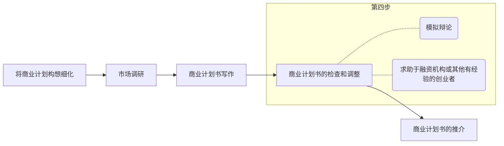

# 第6章 商业计划

## 6.1 商业计划

概念：

1. 广义：对企业活动进行详尽的、全方位的筹划，从企业内部的人员、制度、管理以及企业的产品、营销和市场等各个方面展开分析。
2. 狭义：创业的商业计划，向投资方和创业投资者说明公司未来发展战略与实施计划balabalabala

好的商业计划要从三个方面考虑问题：市场、投资者和创业者本身。

商业计划具有“**计划**”和“**营销**”两大功能。

**为什么**要有商业计划书？

1. 创业融资：<u>商业计划书的质量</u>，往往决定着企业融资的成败。一份优秀的商业计划正是创业者吸引<u>融资</u>的“敲门砖”和“通行证”。
2. 认识自己：编写商业计划的过程也是企业<u>认识自己</u>的过程。
3. 战略思考：商业计划建立在详尽的分析基础之上，这不仅可以大大节省时间和减轻以后的压力，还有助于<u>战略思考</u>。
4. 创建和凝聚团队：商业计划是创业团队沟通的“语言”和凝聚团队力量的重要手段。
5. 取得政府和相关机构支持

吸引风险投资商的商业计划：产业和市场、产品和技术、风险和盈利、管理和组织及竞争战略等问题进行重点描述，并对资金需求、资金使用、回报和推出措施等加以说明，力求吸引投资者的眼球。

吸引合伙人的商业计划：还需说明合伙人的出资方式以及利益分享机制

获取政府或公共部门支持的商业计划：创业活动的经济和社会意义，希望给予的具体支持

## 6.2 如何制定商业计划书

商业计划书是个实时文件，必须随着企业的发展不断进行完善和修改，甚至完全的颠覆。

写作步骤：

商业计划书的六大要素：

1. 商业模式
2. 市场
3. 产品（服务）
4. 竞争
5. 管理团队
6. 行动

商业计划书的基本要求：力求准确、简明扼要、条理清晰、诸种语言、强调可信性

## 6.3 商业计划书的主要内容

结构与格式

1. 封面或封页
2. 内容索引和目录
3. 摘要
   1. 最好在最后完成摘要部分
   2. 针对性
   3. 文笔生动，开门见山
   4. 反复检查，防错别字等
4. 企业介绍
   1. 一般描述
   2. 业务性质
   3. 业务发展历史
   4. 业务展望
   5. 公司组织架构：所有制性质和附属关系
   6. 营销
   7. 供应商
   8. 专利与商标
5. 产品（服务）
   1. 简要介绍
   2. 产品（服务）价格
   3. 独特性
   4. 顾客或买主
6. 技术和研发
   1. 未来技术发展趋势
   2. 公司的技术研发力量
   3. 研发计划
   4. 知识产权保护
7. 管理团队和组织：“一流的管理团队+二流的产品（服务）”>"二流的管理团队+一流的产品（服务）"
   1. 管理层的展示：责任划分、业绩、互补性、优秀品质职业道德
   2. 创业所需要的支持和服务：顾问名单
   3. 激励约束机制
   4. 组织模式和组织结构
8. 市场分析：商业计划书的两大功能都要以市场分析为基础
   1. 产业分析
   2. 目标顾客
   3. 竞争分析
9. 营销计划
   1. 总体营销战略（企业定位+4P+4P未能覆盖内容）
   2. ”4P“
      1. **产品战略**（营销“4P”的<u>第一要素</u>）
      2. **定价战略**
      3. **渠道战略**
      4. **促销战略**
   3. 销售目标和战略实施
10. 生产计划：生产资源、生产过程、生产目标
11. 财务计划：商业计划的核心和灵魂
    1. 财务报表
    2. 财务预测
    3. 融资计划
12. 风险管理
13. 退出策略：公开上市（不畅通）、兼并收购、回购等

## 6.4 商业计划书中的一些常见问题

执行总结太长

过分强调基数

缺乏市场分析和竞争对手分析

过于乐观，对风险及相应对策考虑不足

## 本章小结

对创业者来说，商业计划在融资和计划方面具有重要的作用。本章向读者描述了商业计划的全貌。首先，创业者应了解商业计划的目标 ——融资和行动计划，对此，创业者不仅需要分析自己，还要关注读者——风险投资者；其次，结合对商业计划内容的揭示，本章说明了创业者该如何思考，商业计划的读者关心哪些内容，存在着哪些细节问题，如何写作，等待。另外，由于商业计划会涉及很多更专业的技术问题，读一些参考书是必要的。

## 复习与讨论题

1. 商业计划的构成框架及其关键要素包括哪些？
   1. 关键要素：商业模式、市场、产品（服务）、竞争、管理团队、行动
   2. 构成框架
      1. 封面或封页
      2. 内容索引和目录
      3. 摘要
      4. 企业介绍
      5. 产品（服务）
      6. 技术
      7. 管理团队和组织
      8. 市场分析
      9. 营销计划
      10. 生产计划
      11. 财务计划
      12. 风险管理
      13. 退出策略
2. 对于不同发展阶段、不同行业的创业企业，商业计划在写作上应该有哪些侧重？
   1. 不同发展阶段：
      1. 种子期：突出核心技术
      2. 成长期和发展阶段：侧重市场定位和市场营销
      3. 成熟公司内部的公司创业：注重与整体战略的协调
3. 阅读几个商业计划的案例，比较他们的异同，脚裂它们的不同侧重并理解其原因。