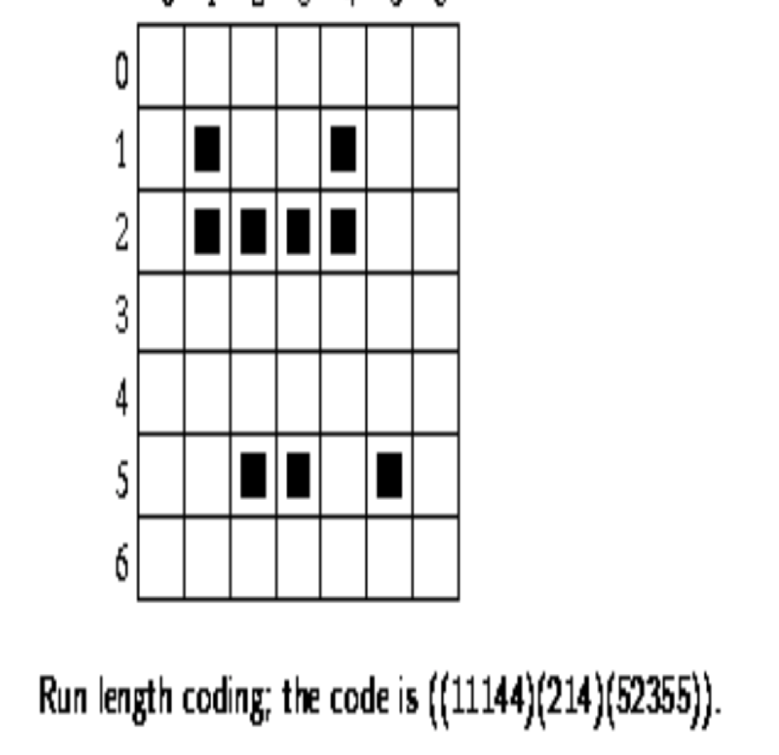
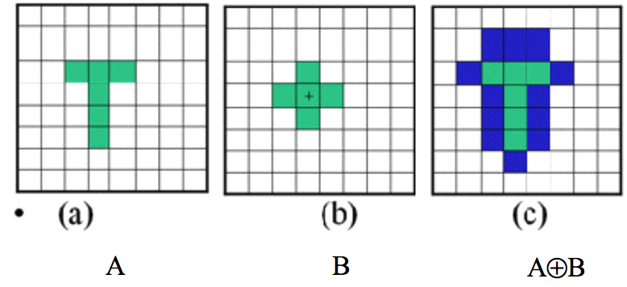
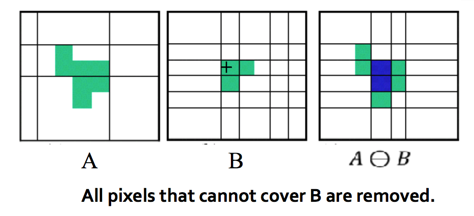
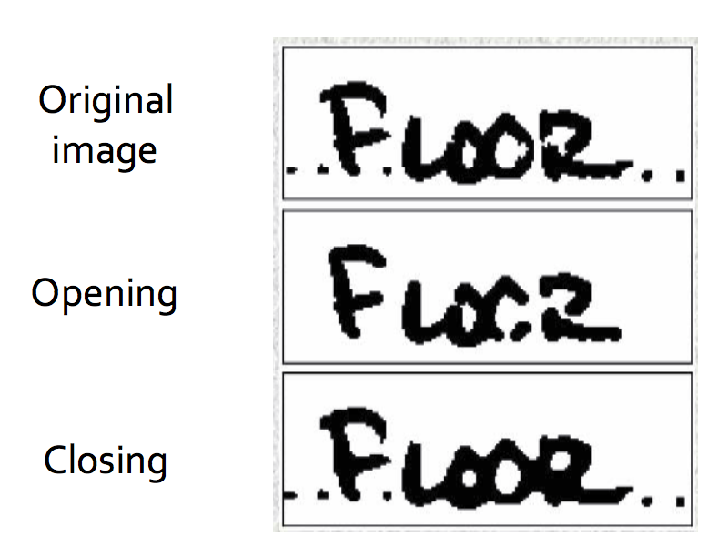
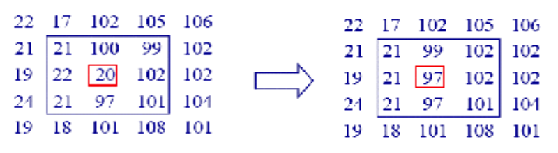
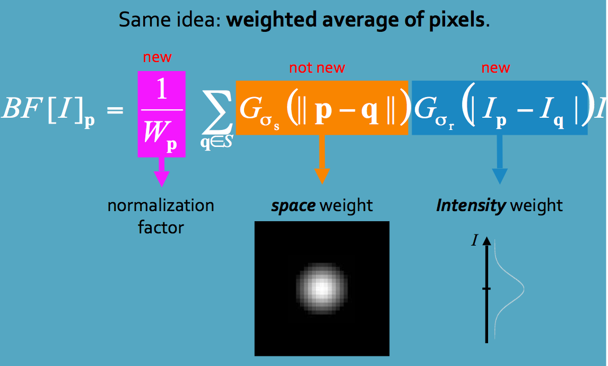
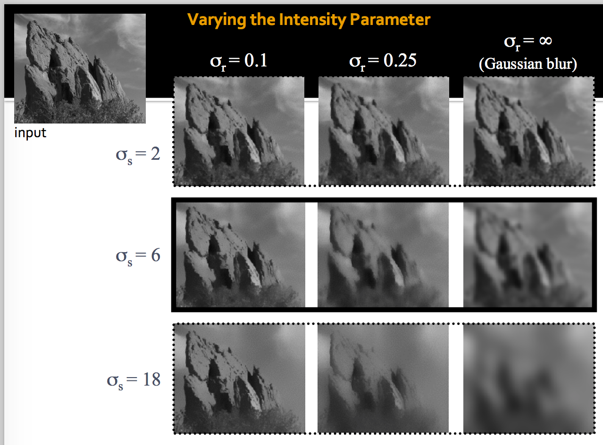
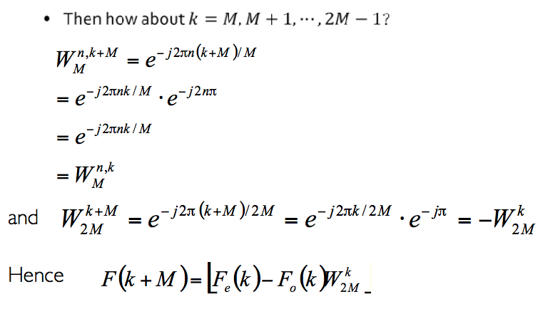
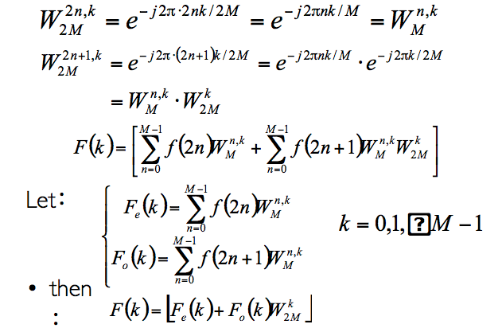
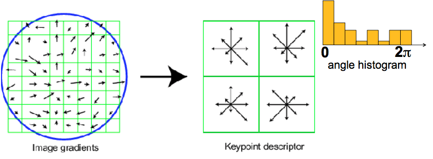

# Check list

###### created by wth

### 一

- [ ] 光圈、焦距，对成像、景深的影响
      加上棱镜光圈越大，景深越浅
      长焦，景深越浅
      对小孔成像，光圈越小越好，太小也不行

- [ ] 成像原理
      CCD，电信号，电信号转图像，调整对比度、白平衡等

- [ ] 彩色(chromatic color)和消色（Achromatic color），加色和补色，减色，三原色 

      >  RGB是加色，加光，CMYK是减色，涂颜料

- [ ] 考：问设备无关的颜色空间模型，设备相关的颜色模型有哪些？
      设备无关：CIE models, CIE XYZ, CIE L\*a\*b, CIE YUV
      设备相关：CMY,HSV,RGB

- [ ] 解释RGB，CMY，HSV的意思，转换公式不用记

      >  CMY：C青色，M品红，Y黄色
      >
      >  HSV：H色相，S饱和度，V明度
      >
      >  YUV: Y明亮度，U色度，V浓度

- [ ] 考：图像格式，无损压缩，有损压缩举例

      无损：bmp(但是支持run length code)，png

      有损：jpeg（DCT算法），gif

      均可：tiff

- [ ] **==Bitmap data 小房子这页slide必须掌握==**

      bmp图片存储矩阵是上下颠倒的（即矩阵第一行是图片最下面），每一行的byte数必须是4的倍数，不然要在最后加padding

- [ ] 行成编码要掌握 run length code

      

      第一行1开始，1结束，4开始，4结束……

### 二

- [ ] ==**怎么二值化要掌握，1.全局thresholding   2.复杂公式版，可能要考公式，记住思想自己推，至少记住步骤**==
      $$
      Target:minimize\ variance\ \sigma \\
      W_f = \frac {N_f}{N}, W_b=\frac{N_b}{N}, W_f + W_b = 1\\
      \mu=W_f * \mu_f + W_b * \mu_b\\
      \sigma = W_f(\mu_f-\mu)^2+W_b(\mu_b-\mu)^2\\
      \Rightarrow minimize\ W_bW_f(\mu_f-\mu_b)^2
      $$
      枚举threshholding，检验那个thresh对应的方差最小

- [ ] 形态学操作，考：像素图手画结果或者物理意义
      Dilation:structure elemetn范围内有1就为1

      
      Erosion: structure element 范围内有0就是0
      

      ​

      应用：提取边界，填洞，提取结构

      Opening

      先ersion再dilation

      Closing

      先dilation再erosion

      

- [ ] 灰度划分，为什么是256个灰度级而不是128，weber‘s law， 2%
      人眼差不多能分别出2%以上的灰度差别，再低难以分辨。
      由设备极限决定。

- [ ] **==亮度变化，logarithm algorithm，必须掌握==**
      L代表亮度，对于RGB来说应该可以直接用3通道？
      $$
      L_d=\frac{log(L_w+1)}{log(L_{max}+1)}
      $$
      ​

- [ ] 直方图均值化
      让色彩分布变得更平均

### 三

- [ ] Nearest neibor

- [ ] **==linear, bilinear interpolation==**，要写的正式一点，写成方程组模式
      $$
      z=Ax + By+Cxy+D\\
      代入4个点坐标
      $$
      ​

- [ ] Morph这一页要掌握
      两张图像生成渐变

- [ ] 怎么实现带皱纹的表情的模仿要掌握

- [ ] 1D卷积的例子要掌握

- [ ] **==均值滤波（高斯滤波）要掌握==**
      simple mean 全是1，
      weighted mean，中间是4，上下左右是2，角上是1
      最后都要除以总值

- [ ] **==中值滤波，slide上的例子要掌握==**
      周围9个数的中位数代替该点，都是用原图做
      

- [ ] 双边滤波，基本思想，每个sigma是什么意思，公式不用记，要能解释
      
      
      sigma r 一般设为图像对角线的2%这么大
      sigma s 一般设为gradient的均值或中位值？

- [ ] **==掌握FFT，公式的推导，解释==**

      

      

      ​

### 四

- [ ] 引导滤波，基本思想
      解决双边滤波中的梯度反转、计算缓慢问题，能够保边、非迭代
      I是guide，p是输入图，q是输出图。输出是I的线性表达
      $$
      min\sum(aI_i+b-p_i)^2+\epsilon a^2\\
      q_i=\hat a_iI_i+\hat b_i
      $$
      ​

- [ ] **==特征检测，两页slides， Feature detection: math三页==**

### 五

- [ ] SIFT ，74 75

1. 获得特征点
2. 计算每个像素的梯度方向
3. 抛弃梯度太小的像素
4. 为剩下的像素建立8格的直方图
5. 分为4*4的格子，每个格子内是直方图的统计结果，每个特征转化为4\*4\*8=128维的高维向量，作为descriptor，完

### 六

- [ ] bag of words

### 七

- [ ] CNN，BP
- [ ] laplace 要掌握 spatial filtering，公式
      实质上是二阶导数，可以获取变化剧烈的地方，轮廓，与原图结合相当于图像增强
      中间是-4，上下左右是1，角上是0
      或中间是-8，其他都是1

