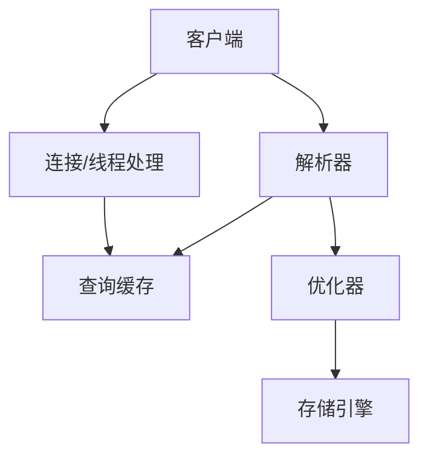

#  Database notebook

作业答案： https://wenku.baidu.com/view/69529f1aaf1ffc4ffe47acd9.html

### 索引

假如你现在看一本书，首先肯定会先看书的目录，看看这本书到底有哪些内容，然后通过目录找到自己感兴趣的章节进行阅读

这里的书就相当于数据库中的表，目录就相当于索引，查询表中的数据通过索引可以快速找到对应的数据

索引的数据结构是B+树，这里的B指的是balance（平衡）

```sql
//普通索引
alter table table_name add index index_name (column_list) ;
//唯一索引
alter table table_name add unique (column_list) ;
//主键索引
alter table table_name add primary key (column_list) ;
一个主键可以有多个列.学生的名字、年龄、班级都可能重复，无法使用单个字段来唯一标识，这时，我们可以将多个字段设置为主键，形成复合主键，这多个字段联合标识唯一性
复合主键就是含有一个以上的字段组成,如ID+name,ID+phone等,而联合主键要同时是两个表的主题组合起来的。这是和复合主键最大的区别
```

```sql
drop index index_name on table_name ;
alter table table_name drop index index_name ;
alter table table_name drop primary key ;
```

 建表时，LOGIN_NAME长度为100，这里用16，是因为一般情况下名字的长度不会超过16，这样会加快索引查询速度，还会减少索引文件的大小，提高INSERT，UPDATE的更新速度。

​    如果分别给LOGIN_NAME,CITY,AGE建立单列索引，让该表有3个单列索引，查询时和组合索引的效率是大不一样的，甚至远远低于我们的组合索引。虽然此时有三个索引，但mysql只能用到其中的那个它认为似乎是最有效率的单列索引，另外两个是用不到的，也就是说还是一个全表扫描的过程。

建立这样的组合索引，就相当于分别建立如下三种组合索引：

```
LOGIN_NAME,CITY,AGE
LOGIN_NAME,CITY
LOGIN_NAME
```

　　为什么没有CITY,AGE等这样的组合索引呢？这是因为mysql组合索引“最左前缀”的结果。简单的理解就是只从最左边的开始组合，并不是只要包含这三列的查询都会用到该组合索引。也就是说**name_city_age(LOGIN_NAME(16),CITY,AGE)从左到右进行索引，如果没有左前索引，mysql不会执行索引查询**。

   如果索引列长度过长,这种列索引时将会产生很大的索引文件,不便于操作,可以使用前缀索引方式进行索引，前缀索引应该控制在一个合适的点,控制在0.31黄金值即可(大于这个值就可以创建)。

### 事务

atomic原子性: 要么全部完成, 要么全部失败. 

一致性consistent:   转账前后两个金额的和应该保持不变.

isolation隔离性: 一个事务感受不到另一个事务在并发执行.

durability持久性: 数据库崩溃后可以回到之前的状态. 

commit, 事务启动后的更改被写入磁盘.

rollback, 事务启动后的更改 回到开始前的状态.

Atomic: Either all complete or all fail.

Consistent: The sum of the two amount of account  before and after the transfer should remain the same.

Isolation: One transaction cannot feel that another transaction is executing concurrently.

Durability: After the database crashes, it can return to the previous state.

commit, the changes after the transaction started are written to disk.

rollback, the changes after the transaction started return to the state before the start.

#### 什么情况会用到事务? 

事务一般用在并发操作多张表的时候使用，用于保护用户数据的完整性。或者说，事务是在对数据进行操作，并且确定两种操作同时成立时运用，这样做的目的就是保证两个操作都正确，都达到目的，只要一方出错，就会回滚数据，保证了两个操作的安全。

事务的五个状态:

active  执行中

partially committed部分提交, 最后一个操作执行完成, 但是没有变更刷新到磁盘.

fail失败的, 事务无法继续执行. 

abort中止的, 失败,回滚操作完毕, 恢复到执行前状态 

committed  从partially committed->committed, 修改过的数据都同步到磁盘后, 就是committed

脏写: 一个事务A修改了其他事务B未提交的数据. B回滚了, A写的也就没了.

脏写的问题太严重了，任何隔离级别都必须避免。其它无论是脏读，不可重复读，还是幻读，它们都属于数据库的读一致性的问题，都是在一个事务里面前后两次读取出现了不一致的情况。

脏读: 一个事务读到了其他事务未提交的数据.

不可重复读（Non-Repeatable Read）: **不可重复读指的是在一个事务执行过程中，读取到其它事务已提交的数据，导致两次读取的结果不一致**。

幻读（Phantom） **幻读是指的是在一个事务执行过程中，读取到了其他事务新插入数据，导致两次读取的结果不一致**。

mysql会自动为增删改语句加事务

不可重复读和幻读的区别在于**不可重复读是读到的是其他事务修改或者删除的数据，而幻读读到的是其它事务新插入的数据**。

`InnoDB`支持四个隔离级别（和`SQL`标准定义的基本一致）。隔离级别越高，事务的并发度就越低。唯一的区别就在于，`**InnoDB**` **在`可重复读（REPEATABLE READ）`的级别就解决了幻读的问题**。这也是`InnoDB`使用`可重复读` 作为事务默认隔离级别的原因。

### MVCC

- **版本链**

在`InnoDB`中，每行记录实际上都包含了两个隐藏字段：事务id(`trx_id`)和回滚指针(`roll_pointer`)。

1. `trx_id`：事务id。每次修改某行记录时，都会把该事务的事务id赋值给`trx_id`隐藏列。
2. `roll_pointer`：回滚指针。每次修改某行记录时，都会把`undo`日志地址赋值给`roll_pointer`隐藏列。

`InnoDB`通过`ReadView`实现了这个功能

事务并发访问同一数据资源的情况主要就分为`读-读`、`写-写`和`读-写`三种。

1. `读-读` 即并发事务同时访问同一行数据记录。由于两个事务都进行只读操作，不会对记录造成任何影响，因此并发读完全允许。
2. `写-写` 即并发事务同时修改同一行数据记录。这种情况下可能导致`脏写`问题，这是任何情况下都不允许发生的，因此只能通过`加锁`实现，也就是当一个事务需要对某行记录进行修改时，首先会先给这条记录加锁，如果加锁成功则继续执行，否则就排队等待，事务执行完成或回滚会自动释放锁。
3. `读-写` 即一个事务进行读取操作，另一个进行写入操作。这种情况下可能会产生`脏读`、`不可重复读`、`幻读`。最好的方案是**读操作利用多版本并发控制（`MVCC`），写操作进行加锁**。

### sql 

### **一、关系模型的三要素：**

- **关系数据结构**：关系模型中只包含单一的数据结构----关系，在用户看来关系模型中数据的逻辑结构是一张扁平的二维表

- **关系操作**（操作对象和结果都是集合）：

- - 查询：选择、投影、连接、并、差、交、笛卡尔积
  - 更新（插入、删除、修改）

- **关系的完整性约束**：

- - 实体完整性：主属性不能为空，主码不相等
  - 参照完整性：例如，学生（学号、姓名、专业号），专业（专业号，专业名），学生关系中的专业号需要参照专业关系中的专业号，称学生关系中的专业号是学生关系的外码，专业关系是被参照关系，学生关系为参照关系，外码与主码不一定要同名，学生关系中的外码取值要么为空值，要么为专业关系中对应专业号的值
  - 用户定义完整性：例如，学生的成绩取值范围在0~100之间

### **二、关系中涉及的基本概念**

**域**：一组具有相同数据类型的值的集合，例如：{0，1}、{男，女}

**候选码**：某一属性组的值能唯一地标识一个元组，而其子集不能的属性组

**主码**：若一个关系有多个候选码，则选定一个作为主码

**主属性**：候选码的诸属性

**非主属性（非码属性）**：不包含任何候选码中的属性

**全码**：关系模式的所有属性是这个关系模式的候选码

### mysql



#### 第一范式(1NF)

- 概念 数据表的每个字段(属性)必须是唯一的、不可分割的。
- 唯一性 比如：在一张学生信息表里不能有两个名称都是name的字段。
- 不可分割性 比如：在一张学生信息表不能出现类似name_mobile这样的字段，很明显name_mobile是可以分割成name和mobile两个字段的。

#### 第二范式(2NF)

- 概念 数据表的每条记录必须是唯一的(**主键约束**)，且非主键字段只依赖于主键。
- 唯一性 比如说：不能同时存在id ＝ 1的记录（id为主键）。
- 依赖性 比如说：在一张学生信息表（student_id为主键），不应该出现course_name(课程名称，依赖于course_id)这样的字段，因为，如果有一天，《心理健康教育》课程名要改成《心理健康教育杂谈》，就得改课程表和学生信息表的课程名称了。

#### 第三范式(3NF)

- 概念 数据表中不应该存在多余的字段，也就是说每个字段都不能由其他字段推理得到。
- 例子 比如说：学生信息表里不能同时存在province_id(省份ID)、city_id(城市ID)这两个字段，因为province_id可以由city_id推理得到

#### 逆范式

- 概念 就是不按照标准的范式去设计数据库
- 逆 在数据库的实践过程中，我们可能遇到数据量非常大的数据表，这时候去做join查询是非常损耗性能的，甚至导致数据库连接超时、挂掉等问题。所以呢，有时候就需要数据库多冗余设计，对一些字段做冗余，以避免大表之间的join。 

### Lec2

relational model

##### 六个互相正交的基本属性

做笛卡尔积之前, 先尽量把别的选择操作做了. 

改名操作, 可以用来找最大账户balance.  内部实现是rename笛卡尔积.

关系代数的投影是集合操作, 自动去重. sql要加distinct.

##### 四种基本操作

Set intersection   **交** 

自然连接: 一般都是笛卡尔积然后选择, 就把这两个操作组合叫做自然连接. natural join. 这是连表查询中最常见的

theta连接, 自然连接之后根据theta条件来查询.

除法操作. 当涉及到求“全部”之类的查询，常用“除法”

广义投影 , 加了选择, 运算.

聚合函数

方便起见, 我们可以在聚合函数中直接rename. 

insertion就是加法, 就是并集

deletion 就是减法. 

update就是广义投影操作. 

### Lec3 SQL1

1975年IBM发明sql.  ANSI (American National standard institute)提出标准, 从SQL86到SQL99.

SQL92 在商业化软件用的最多. SQL92和99标准分为4级,  但是没有DBMS 产品达到第四级full SQL level.

因为oracle 要保证自己的unique， 不可替代性, 不能容易被替换掉. 所以故意20%和别人不一样。 

##### 三种

DDL 

```sql
Create view, drop view
Create index, ..
Create table , alter table
Create trigger 
```

DML 

select , insert , delete , update 

DCL控制

Grant, revoke 权限控制

#### DDL

创建表

可以用check 来检查属性

primary key 可以直接设置到列名后面， 或者在声明所有列后再设置

删除表

用drop， 会删除数据和schema， delete是删除数据内容

alter table

改变schema， 新增列， 改变属性的类型， 改变完整性约束。

##### 创建索引

```sql
create index <i-name> on <table-name>(attribute)
create unique index 
```

#### DML

select 对应的是投影操作

from 多个表对应的是笛卡尔积

select 大小写不敏感。 支持下划线。 

distinct 去重 ，all 不做去重，默认是all。 

where 可以用between and 

学习这些还是看作业实践一下， 有例子就好很多 。

改名， 可以简化。 还有自己和自己比较的时候必须rename分裂成两个实例

##### 字符串操作

`% 匹配字符串， 类似于 *`

`_ 匹配单个字符，类似于？`

`select “abv” || name`  可以实现拼接。

order by 根据字母序排序， 默认升序， desc 是降序。 可以多个属性排序， 比如可以： ` orderby a, b desc, c` 

##### 集合操作

并union  交 intersect 补 except ， 后面加all表示 retain all duplicates。 

##### 聚合函数

例如取平均值 `select avg(balance) group by branch_name ` 

聚合函数 `  count(name) tot_num  `可以直接跟着重命名，不用as.还可以 `count(distinct name)`  先去重再count 。 这个考试会考。

having和where 后面都是布尔表达式 ， having 是分组完成之后才能做的  ， where是分组完成之前的。 先做的放在where。 

group by 如果有两个并列最大, 就会出错. 

##### 执行顺序

from -> where-> group -> having -> select -> distinct - > order by

如果聚合的值要判断， 就having 

大部分认为null是0 ， count可能会把null计入。 

#### 视图

`create view <v_name> as select c1,c2 from ... ` 启动应用的时候加载到内存， 调用的时候比较快。

 建立在单个基本表上的视图，且视图的列对应表的列，称为“行列视图”。 可以写入.  多张表的视图不能写入. 

View 是虚表，对其进行的所有操作都将转化为对基表的操作。

查询操作时，VIEW与基表没有区别，但对VIEW的更新操作有严格限制，如只有行列视图，可更新数据。

### Lec4 SQL2

#### 嵌套查询

from子句中

```sql
where col not in (select col from table1)
-- 甚至还可以tuple 
where (br, col) in (select br, col from xxxx)
```

```sql
-- Find the account_number with the maximum balance for every branch. 每组求最大值, 比较复杂
WHERE balance >= max(balance)  -- 这样写是不行的,  因为还没分组, 查出来的是整个表最大的, 而不是每个branch最大的. 
SELECT account_number, max(balance) 
FROM account  -- 这样写也不行
-- 表的自比较,需要重命名,答案如下
SELECT account_number AN, balance 
FROM account  A 
WHERE balance >= (SELECT max(balance)      
                  FROM account B
									WHERE A.branch_name = B.branch_name)
ORDER by balance
```
##### 一些trick

不存在怎么弄？  用except

等于另一个怎么弄？  嵌套查询

大于等于1 怎么弄？  自然连接连接上了就说明肯定有一个. 

##### some

some是sql保留字, 就是一个数字不能大于一个集合, some就是说比其中一个大就行.  

some可能大于是ture, 小于也是true 等于也是true.   大于全部要用all 关键字

```sql
WHERE assets > some
(SELECT assets 
 FROM branch 
 WHERE branch_city = ‘Brooklyn’)
```

select语句中没有关系代数的除法操作, 要依靠 not exists, except 组合实现. 

##### unique 

找到最多只有一个的数据.

`where unique xx`

Oracle 8 and SQL Server 7 do not support unique and not unique

#### 临时表

(不管是否被引用，导出表(或称嵌套表)必须给出别名) 

```sql
from (select  xxx )
as result (branch_name,avg_bal)
```

#### with语句

作为select 前面的一些准备. 比如可以产生临时表

这整个是sql语句

```sql
with tmptable(value) as 
  select xx 
  from xx 
select bb
from tmptable
```

with 可以有多个, 但是只有一个主语句会用这些with产生的临时表, 主语句结束后别的语句不认

#### 删除


#### 插入

可以跟select 语句, 把select结果插入到另一个表.  字符串和日期需要单引号

```sql
  INSERT INTO account (branch_name, balance, account_number) 
        VALUES (‘Perryridge’, 1200, ‘A_9732’)  
```

#### 更新

update语句, 可以用where , case关键字.

```sql
UPDATE account 
SET balance = case 
when  balance <= 10000 
then balance * 1.0 
else balance * 1.06 
end
```

#### 连接

inner join 内连接就是自然连接, 两边都要有. 

left outer join左外连接, 产生结果行数等于左边的行数, 找不到就设置为null

full outer join , 左外连接的结果 UNION 右外连接的结果.

自然连接,最常用：*R* natural {inner join, left join, right join, full join} *S*  把公共属性去重.

还可以非自然连接：

```sql
R{inner join, left join, right join, full join} S
on <连接条件判别式>
using (<同名的等值连接   属性名>) 
```

Key word *Inner*, *outer* is optional, 是可以省略的

**Natural join:** 以同名属性相等作为连接条件

**Inner join**：只输出匹配成功的元组

**Outer join：**还要考虑不能匹配的元组

 非自然连接，容许不同名属性的比较，且结果关系中不消去重名属性, 也就是说, 结果可能会有同名的属性.

使用using的连接类似于natural连接，但仅以using列出的公共属性为连接条件. 

Find the names of courses that have maximum average score. 

可能有多个课都一样高, 就要用 in 

```sql
SELECT course_name 
FROM course 
WHERE course_no in   -- 可能有多个课都一样高
    (SELECT course_no 
	FROM study 
	GROUP BY course_no 
	HAVING avg(score) >= all 
		(SELECT avg(score) 
		 FROM study 
  		 GROUP BY course_no)) 
```

### lec5 高级sql

create type

create new domain ,  domain可以加限制条件,

```sql
create domain dollars as numeric(2,2) not null;
create table employee (
	eno char(10) primary key,
    salary dollars
);
```

大对象类型 blob(20MB)  clob 最大10KB

#### 外键

是作为integrity constraint.

FOREIGN KEY 约束用于预防破坏表之间连接的行为。

FOREIGN KEY 约束也能防止非法数据插入外键列，因为它必须是它指向的那个表中的值之一。

Assume there exists relations *r* and *s*: *r*(*A*, *B*, *C*), *s*(*B*, D), we say attribute *B* in *r* is a foreign key from relation *r*, and *r* is called *referencing relation* (参照关系), and *s* is called *referenced relation* (被参照关系)*.* 

ØE.g., 学生(学号, 姓名, 性别, 专业号, 年龄) --- 参照关系 

​    专业(专业号, 专业名称) --- 被参照关系 (目标关系) 

​    其中属性专业号称为关系*学生*的外码。 

Ø*Account*(*account-number*, *branch-name*, *balance*) --- 参照关系 

 *Branch*(*branch-name*, *branch-city*, *assets*) --- 被参照关系 

参照关系中外码的值必须在被参照关系中实际存在，或为null. 

 专业删除的时候, 要看学生, 不能随意删除. 要么 rejected as an error, 要么 tuples in *t*2 that references *t*1 must themselves be deleted (cascading deletions are possible). 

学生插入的时候, 要检查在专业中存在.  

cascading action 

```sql
create table account(...foreign key( br) references brtable
on delete cascade
on update cascade,
                     ...
)
```

如果删除brtable中的tuple, 那么account中也会删除.  除了cascade还可以set null 或者 set default.

Note: Referential integrity is only checked at the end of a transaction !!  因为可能有环.

#### 断言

```sql
 CREATE ASSERTION <assertion-name> 
  CHECK <predicate>; 
```

sql没有说都存在, 只能用 not exist 嵌套 not exist.

#### 触发器

account update 后, 就执行动作

```sql
CREATE TRIGGER overdraft-trigger after update on account 
	referencing new row as nrow for each row 
	-- new row 是保留关键字, 表示改的那一行. 
	when nrow.balance < 0 
	  begin atomic -- 要么全部执行, 要么全部不执行. 
		insert into borrower 
			(select customer-name, account-number from depositor 
	 		 where nrow.account-number = depositor.account-number) 
	    	insert into loan values 
			(nrow.account-number, nrow.branch-name, – nrow.balance) 
	    	update account set balance = 0 
			where account.account-number = nrow.account-number 
	    end 
```

- Triggering event can be insert, delete or update. 

- Triggers on update can be restricted to specific attributes：

E.g., Create trigger *overdraft-trigger*

​      after update of *balance* on *account …* 

- Values of attributes before and after an update can be referenced: 

Referencing old row as: for deletes and updates 

Referencing new row as: for inserts and updates 

##### 语句触发器

多行数据修改

`for each statement` instead of `for each row` 

 `referencing old table` or `referencing new table` to refer to temporary tables (called *transition tables*) containing the affected rows 

 Can be more efficient when dealing with SQL statements that update a large number of rows 

##### External World Actions 

Triggers cannot be used to directly implement external-world actions

但是 Triggers can be used to record actions-to-be-taken in a separate table. Have an external process that repeatedly scans the table, carries out external-world actions and deletes action from table. 

例子如下:  这就是做一次补货

```sql
CREATE TRIGGER reorder-trigger after update of level on inventory 
	referencing old row as orow, new row as nrow 
   	for each row 
		when nrow.level <= (select level 
			                      from minlevel 
			                      where minlevel.item = nrow.item) 
                   and orow.level > (select level 
			                      from minlevel 
		                                   where minlevel.item = orow.item)  -- 容易忘记判断orow, 新一次低于了就补货. 不能每次都低于都补货. 
	begin 
		insert into orders 
			(select item, amount 
			 from reorder 
		              where reorder.item = orow.item) 
	end 
```

sql server  Inserted, deleted 相当于前法的*nrow* (称为过渡表, transition table)和*orow* 

```sql
CREATE TRIGGER overdraft-trigger on account
 for update as 
 if inserted.balance < 0 
```

#### grant

所谓Role，可以认为是一个权限的集合，这个集合有一个统一的名字，就是Role名，你可以为多个账户赋予统一的某个Role的权限，而权限的修改可以直接通过修改Role来实现，而无需每个账户逐一GRANT权限，大大方便了运维和管理。

Role可以被创建，修改和删除，并作用到其所属于的账户上。

https://developer.aliyun.com/article/60654

如果user1将 select access 通过granted by current role 给另一个user2 授予, 即使user1的role被收回, user2还是可以拥有这个role.

#### Authorization

grant 可以传递,  从DBA为root 形成一个authorization graph

##### Privileges in SQL 

增删改查, 还有reference. 

`grant select on branch to U1 with grant option`  with grant option 可以传递 , gives U1 the select privileges on *branch* and allows U1 to grant this privilege to others. 

回收权限 

REVOKE <privilege list> ON <table | view> 

​     FROM <user list> [restrict | cascade] 

```sql
Revoke select on branch from U1, U3 cascade; // U1赋予别人的也都会回收
Revoke select on branch from U1, U3 restrict;
```

authorization 不会控制到每一行, 资源消耗太大. 

##### audit trails 

E.g., `audit table by scott by access whenever successful` ---- 审计用户scott每次成功地执行有关table的语句 (create table, drop table, alter table)。 

例子2 `audit delete, update on student` --- 审计所有用户对student表的delete和update操作。 

q怎样看审计结果：

Ø审计结果记录在数据字典表: sys.aud$中，也可从dba_audit_trail, dba_audit_statement, dba_audit_object中获得有关情况。

Ø上述数据字典表需在DBA用户（system）下才可见。

#### 嵌入式sql

:*V_an*, :*bn*, :*bal*是宿主变量，可在宿主语言程序中赋值，从而将值带入SQL。宿主变量在宿主语言中使用时不加:号。

#### ODBC

```c
  if (error == SQL_SUCCESS) { 
	  SQLBindCol(stmt, 1, SQL_C_CHAR, branchname,80, &lenOut1); 
	  SQLBindCol(stmt, 2, SQL_C_FLOAT, &balance, 0, &lenOut2); 
	  /* 对stmt中的返回结果数据加以分离，并与相应变量绑定。第1项数据转换为C的字符
	  类型，送变量branchname(最大长度为80)， lenOut1为实际字符串长度（若＝-1代表
	  null），第2项数据转换为C的浮点类型送变量balance中 */ 
	  while ( SQLFetch(stmt) >= SQL_SUCCESS) { /* 逐行从数据区stmt中取数据，放到绑定变量中 */ 
	  printf (“ %s  %d\n”, branchname, balance); 
            /*  对取出的数据进行处理*/       … …          } 
				      }   …… 
	} 
	  SQLFreeStmt(stmt, SQL_DROP);  /* 释放数据区*/ 
```

`ROLLUP`是`GROUP BY`子句的扩展。 `ROLLUP`选项允许包含表示小计的额外行，通常称为超级聚合行，以及总计行。 通过使用`ROLLUP`选项，可以使用单个查询生成多个[分组集](http://www.yiibai.com/sql/sql-grouping-sets.html)。


primary key可以叫做码

参与一个联系集的各实体集的primary keys的组合，构成该联系集的超码

作为码的属性不能为空，值不应常变. 

全参与和部分参与. weak entity set 

### Lec6 实体关系模型

#### Entity Sets

实体是一个对象， 可以是具体的，也可以是抽象的。

实体有属性attributes。 一个实体集包含多个同类实体

domain： 就是值域

一个联系集表示二个或多个实体集之间的关联 

#### super key
如果一个属性可以把不同的实体区分开，那它就是一个超码。
如果一个超码他任意的真子集都不能成为超码，那这样的最小超码就叫做候选码，candidate key , 最小的super key, 小一个就不能作为super key。

有箭头表示一对一, 没有箭头表示一对多

#### E-R 设计

若一个对象只对其名字及单值感兴趣，则可作为属性，如性别；

若一个对象除名字外，本身还有其他属性需描述，则该对象应定义为实体集。如电话, 部门
一个对象不能同时作为实体和属性. 
一个实体集不能与另一实体集的属性相关联，只能实体与实体相联系. 

(二个对象之间发生的动作 --- 用“relationship set”表示). 

例子， 画 e-r 图， 转化为relational schema。

联系可以具有描述性属性。
二元联系集就是涉及两个实体集的联系，及数据库中的大部分连线都是二元的，但是有一些实体集会多于两个。
参与联系集的实体集，它的数目也被叫做度。
复合属性它可以分为多个简单属性。
单值属性和多值属性，比如一个员工可以有一个或多个电话号码，所以就不同的员工实体在电话号码这个属性上就会有不同的值，这个属性就叫做多值属性。比方说一个员工可能有多个亲属。
映射基数：一个实体通过一个连续机能和多少个实体相关联。
派生属性： 这个属性的值可以从别的相关属性或实体中派生出来，比方说有一个贷款数量这个属性，那就可以从其他的数量当中计算出来。用来计算派生属性的就是基属性。派生属性的值不存储，但在需要的时候可以被计算出来。
主码应该选择从不变化或者极少变化的属性。 
联系集的主码怎么选择呢？如果是多对多的话，那就可以把两个实体集的**主码共同组成**，如果是多对1的话就选**一一对应的那个主码**。

##### 参与约束

如果每个实体都参与到联系集的至少一个联系中，我们称实体集全部参与联系。如果实体集中只有部分实体参与到联系集的联系中，就叫做部分参与联系集。这个画ER图很爱考。画双线就是全部参与。

#### 图符号

图是怎么画的呢？
画矩形：实体set
椭圆：属性
菱形：联系set
双椭圆：multivalued属性
虚线椭圆 ：派生属性derived attribute
双线 ： 一个实体集全部参与到联系集中。具体来说，实体集中的每一个实体都参与到联系集的至少一个联系当中。也可以在线上标注一下，来指定最小的映射基数到最大的映射基数
双矩形 ： weak实体集。
双菱形： 标识型联系。identifying relationship
箭头：只能是1对1或者多对1。箭头方向指的是1。
如果是1对1的话，那联系集出发的两条线都应该是箭头，一个箭头指向一个实体集。
如果有一些属性和联系集也是相关联的，那我们也要把这些属性用线段连在联系集上。

在菱形和矩形连线上面就可以标注上角色，比方说employee连到联系集上，然后可以标注一个worker。

在联系集外最多只允许有一个箭头，因为一个非二元，联系集外如果有两到更多个箭头的话，可能会存在两种解释，存在混淆。

#### 怎么看用实体还是用属性？

一个常见的错误是把一个实体集的主码作为另一个实体集的属性，比方说把客户的名字作为贷款的属性是不正确的。可能需要一个借贷人这个联系。这样可以明确的表示出两者之间的关系。
还有一个常见的错误是把实体集的主码属性作为联系集的属性。事实上在联系的表示中，已经隐含了这些主码属性。
怎么判断是用实体集还是用联系集呢？当描述发生在实体之间的行为的时候，就是一种联系集
数据库中的联系通常都是二元的，但其实也可以用多元的联系集。

1对1或者一对多联系集的属性。可以放到一个参与该联系的实体集中。这样联系集就不用存储这属性。

#### 弱实体集

 not have a primary key is referred to as a weak entity set. 

例子： 还贷登记表 payment(pay-num, pay-date, pay-amount). 假设为了清楚起见，pay-num按对应的每项贷款分别编号(都从1, 2, 3 …开始), 这样，pay-num就不是码，并且该实体集没有码。故payment是弱实体集。 pay-num is discriminator or partial key (分辨符或部分码). 

一个实体集，他没有足够的属性来形成主码。 主码的实体集就叫做强实体集。

弱实体集必须与另一个称为标识实体集或叫identifying  Entity set。和他关联才有意义，存在依赖于标识实体集。标识实体及 拥有它所标识的弱实体集把这它们之间的联系叫做标识行联系。
要实行联系，他是从弱实体集到标识实体集的，多对一联系，而且弱实体集全部参与联系。

它也需要一个分辨符，然后这个分辨符也叫做这个实体集的部分码
弱实体集的主码由标识实体集的主码和弱实体集的部分码共同组成。

#### 聚集

聚集是一种抽象，通过这种抽象联系被当做高层的实体来看待。就是可以在一个联系和另一个实体中间再建立一个联系。把联系集看作一个高层实体集。

对于一个多对多的二元联系，主码应该是参与实体集的主码属性的并集。
一个1对1的二元联系集，任何一个参与实体集的主码都可以作为联系的主码。
对于多对一的二元联系集，主码应该是联系集中多的那一边的实体集的主码。
对于N元联系集，如果连接到它的边没有箭头，那么主码就是所有参加实体集的主码属性的并集。
如果有一个边有一个箭头的话，那就除去那一边的实体集的主码属性，其他的取并集作为联系的主码。

## 4月19日规范化理论

考点:

第三范式, BCNF, 分解的全部内容. 

https://www.win.tue.nl/~sidorova/informatica6/some-solutions-chapter7.pdf

##### 不好的设计

1. 信息重复

如果把cs系修改了, 那所有老师都要修改.

2. 插入异常

key是老师id, 如果没有老师就没法插入系. 存在别的决定关系, 比如deprt name可以决定building . 这时候就需要分解.

3. 更新困难.

#### 无关属性

a-》ß in F.  如果a去掉属性A , 也成立依赖, 那A就是在a中多余的.

a-》ß in F.  如果ß去掉属性A , 也成立依赖, 那A就是在ß中多余的.

### 分解

#### 无损连接

无损连接分解的条件： 分解后的二个子模式的共同属性必须是R1或R2的码（适用于一分为二的分解）。 要确保有公共属性. 就是无损连接 

R1 交R2 函数决定R1

或者 R2交R1 函数决定R2 . 就是无损连接.

等价于,  if R1∩R2 forms a superkey for either R1 or R2

The decomposition is a lossless-join decomposition (无损连接分解). 
The decomposition is dependency preservation (依赖保持). 每个函数依赖还是有实现.
Each relation Ri is in a good form --- BCNF or 3NF. 

有损分解: 公共属性c不是任何一个表的key, 就会损失原来表的信息, 因为他可以重名.

#### 函数依赖

如果都满足完整性约束,就称为合法的. legal instance, 

如果任意两个tuple t1,t2, t1[x] = t2[x]  => t1[y] = t2[y] 那么 x函数决定y, y函数依赖于x . 即  x->y

 K 是超码  《=》 K -> R.  能决定所有属性

K 是候选码 《=》  K  -> R, and  No a属于 K, a ->  R (不存在K的真子集a，使之满足a ->  R) 

如果 Y是X的子集, 那么 x-》 y 是一个平凡trivial函数依赖.无论合法不合法都成立.

除了平凡的函数依赖, 剩下的都是key.   这样就是一个好的关系模式.

#### 闭包

对于我们做题没啥意义, 但是计算机辅助是可以计算整个闭包.枚举所有函数依赖.

好的关系模式, 左边都是key.

armstrong 公理系统 , 有效sound和完备的complete.

1. 两边同时加一个属性 , 函数依赖也成立.  (augmentation, 增补律) 
2.  (transitivity, 传递律) 

3. A-》BC, 那么A决定B, A决定C

 a y -〉ß y 和 a y-〉ß是等价的. 就是右边去掉也成立.

A的闭包就是A能决定的属性的集合.闭包能决定所有属性, 就可以作为key. 如果真子集不能作为key, 那它就是candidate key候选码.

ae的闭包就是a的闭包+e的闭包.

```visual basic
			result := a; 
		  while (changes to result) do 
		      for each ß > y in F do 
              begin 
				      If ß 属于 result then y加到result
		          end; 
		      a+ := result 
```

看起来 复杂, 其实思路还是很直接的. 其实B的闭包就是连接图中， 从B出发能到的顶点的集合。

##### Canonical Cover (正则覆盖) 

考点，最简覆盖，写成最简函数依赖 

F是最小覆盖

1. f的闭包和fc的闭包是一样的.
2. fc没有无关属性
3. 左边一样的都合并 a->b.  a->c都要合并为 a-》bc

算法

1. 先把左边一样的合并
2. 看哪些是多余属性, 画出**连接图**

ad决定e, d决定e, 求正则覆盖那就d-》e

### BCNF

定义: A relation schema R is in BCNF, F 是函数依赖的集合, if 所有函数依赖 in F+ of the form a决定ß , at least one of the following holds: 

​	a的所有函数决定都是trivial 的
​		or 
​		 a is a superkey for R (i.e., R 是a闭包的子集,  a函数决定 R) 

定义比较复杂， 但是其实看例子还是不难的。

怎么证明不是 BCNF.

有一个alpha 不是key

#### 怎么分解成BCNF?

参考

http://www.mathcs.emory.edu/~cheung/Courses/377/Syllabus/9-NormalForms/examples.html

1 要是无损的

2 每个分解出的关系模式都是BCNF的

基本思想: 如果不是bcnf,  至少有一条函数依赖左边不是key，这条函数依赖拿出来分解。

```verilog
result := {R}; 
	done := false; 
	compute F+; 
	while (not done) do 
	  if (there is a schema Ri in result that is not in BCNF) 
			then begin 
		    let a->b be a nontrivial functional 
		    dependency that holds on Ri such 
		    that a-> Ri is not in F+, and a交b 为空集; 
        result := (result – Ri) 并 (a, b) 并 (Ri – b); //
	    	 end
    else done := true; 
    //将Ri分解为二个子模式: Ri1 = (a, b)和Ri2 = (Ri – b), b是 Ri1 Ri2的共同属性. 
//Note: Finally, every sub-schema is in BCNF, and the decomposition is lossless-join. 

```

∵F+是由Armstrong的3个公理从F推出的, 而任何公理都不会使Functional Dependency (FD)左边变小(拆分), 故如果F中没有违反BCNF的FD (即左边是superkey), 则F+中也不会. 

可在F下判别R是否违反BCNF, 但必须在F+下判别R的分解式是否违反BCNF. 

#### 依赖保持

如果通过检验单一关系上的函数依赖, 就能确保原来所有的函数依赖成立, 那么这样的分解就是依赖保持的dependency preserving. 

不一定所有BCNF的分解都是依赖保持的.很多时候就是不能共得. 因此，有时候就不用BCNF规范, 用3范式。

```
f1 U f2 = F -----> Decomposition is dependency preserving. 
f1 U f2 is a subset of F -----> Not Dependency preserving.
（F1 并F2） + = F+ --> Decomposition is dependency preserving. 
```


### 3范式

Definition: A relation schema R is in third normal form (3NF) if for all      in F+, at least one of the following conditions holds: 
前两个是BCNF
Each attribute A in ß – a is contained in a candidate key for R (即A in ß – a是主属性, 若a 和ß没有交集, 则A = ß是主属性). 
Note: each attribute may be in a different candidate key. 


讨论: 国内其他教材关于3NF的定义: 不存在非主属性对码的部分依赖和传递依赖. 该定义实际是说, 当为非主属性时, 必须是码; 但当为主属性时, 则无限制. 国内外这二种定义本质上是一致的. 


```verilog
Let Fc be a canonical cover for F; 
i := 0; 
for each functional dependency a -> ß in Fc do 
	{if none of the schemas Rj, 1 <=j <= i contains a ß, 
	      then begin 
		    i := i  + 1; 
          Ri := (a ß)  //将Fc中的每个 a -> ß分解为子模式Ri := (a ß), 从而保证 dependency-preserving. 
	      end} 
if none of the schemas Rj,  1 <=j <= i contains a candidate key for R then 
begin 
	i := i  + 1; 
	Ri := any candidate key for R; //保证至少在一个Ri中存在R的候选码, 从而保证 lossless-join. 

end 
return (R1, R2, ..., Ri) 
```

讨论: 对于多于二个子模式Ri (i > 2)的分解, 判别是否无损连接的方法, 其他教材中是用一张i行n列的表来表示. 如果各子模式中函数依赖的相关性使得R中所有的属性都涉及, 则是无损连接分解. 而根据候选码的含义, 候选码必与所有属性相关. 从而二者本质上一致. 

怎么证明是第三范式?

各个Ri自然连接起来就是R

#### 多值依赖

为什么多值属性需要转换成单个关系? 是BCNF,但是不满足第四范式,  存在非平凡的多值依赖

#### 4 范式

##### L1 范式

每个属性是原子的, 不可分的.

不要编码各种信息到学号里, 这样提取太慢了. 每个信息都原子的.

B- C 范式

数字越大， 规范化程度越高， 冗余程度更低。


BC 范式一定是第三范式， 第三范式不一定是BC范式。 可能是别的， 

BC范式可能丢掉函数关系， 第三范式因为不分解所以保留。

### lec8存储和数据结构

cache 最快， 0.5 ns

内存 10-100ns  比磁盘大概快100万倍。

flash ， 读可以和内存差不多， 写10us。 

SATA 150MB/s，

 RAID0 ， 没有重复

RAID1 ， 1比1 备份。

RAID5 ， N+1 存N个。 

#### buffer manager

替换策略

LRU的块可能是下面快要用的块(循环)，而最近刚用过的块则暂时不用，当空间不够时倒是可以将其覆盖的, 故LRU策略不佳。MRU strategy (Most recently used, 最近最常用策略反而比较好。

Toss-immediate  strategy用后立即free space

#### 文件组织

固定长度记录还是变长记录


   

##### 顺序存储

需要定期对文件重新排序

多表Multitable Clustering File Organization

有助于联合查询，不利于单个表查询。 


## lec9 


### B+树

在 B+树中删除关键字时，有以下几种情况：

1、 找到存储有该关键字所在的结点时，由于该结点中关键字个数大于`⌈M/2⌉`，做删除操作不会破坏 B+树，则可以直接删除。

删除关键字 `91`，包含关键字 `91` 的结点 `[85、91、97]` 中关键字的个数 3 大于 `⌈M/2⌉ = 2` ，做删除操作不会破坏 B+树的特性，直接删除。

 当删除某结点中最大或者最小的关键字，就会涉及到更改其双亲结点一直到根结点中所有索引值的更改。

当删除该关键字，导致当前结点中关键字个数小于 `⌈M/2⌉`，若其兄弟结点中含有多余的关键字，可以从兄弟结点中借关键字完成删除操作。

当删除某个关键字之后，结点中关键字个数小于 `⌈M/2⌉` ，则不符合 B+树的特性，则需要按照 3 he 4 两种情况分别处理。以删除关键字  `51` 为例，由于其兄弟结点 `[21、37、44]` 中含有 3 个关键字，所以可以选择借一个关键字 `44`，同时将双亲结点中的索引值 `44` 修改 `37` ，删除过程如下图所示：

第 3 种情况中，如果其兄弟结点没有多余的关键字，则需要同其兄弟结点进行合并。

当进行合并时，可能会产生因合并使其双亲结点破坏 B+树的结构，需要依照以上规律处理其双亲结点。如果父亲节点删除了， 那就要把爷爷和另一边树的叔叔合并。 


小测考点: 

知道item数量, 求node 数量和高度.


### LSM 树

Log structured merge tree

B+树对于SSD上的数据并不友好. 

内存优化的LSM树. 插入速度快, 查找很慢. 

L0树在内存中, 磁盘里有多个越来越大的B+树, 是上一层的K倍.

##### 插入

首先写到L0 tree.

 L0 达到阈值的时候merge到L1,   L1达到阈值的时候merge到L2, 

update 要从上到底全部update.  这样太慢了, 策略是插入一个新的值.  然后如果上面有新的值, 下面的就废弃了.merge的时候清理无效的数据.

#### stepped merge index

现在很多插入密集型的数据库都用这个方法.

如果需要频繁merge, 方法是把大的L1 拆成多个小B+树.

这个策略甚至可以不merge, 直接在下一级生成一个小的B+树, 然后等一级全部满了再merge 到下一级. 

缺点: 算法实现更加麻烦.  

##### 查找

很慢, 可以用布隆过滤器Bloom Filter优化. 要查找之前可以先在布隆过滤器查找, 如果存在再在L树查找, 如果不存在那么L树也不存在


还有一种buffer tree

在internal node中保留一段buffer, 存插入的索引项, 减少下面的IO操作. 


## lec10 查询处理和优化

作业答案:

https://www.db-book.com/db6/practice-exer-dir/12s.pdf

1. 语法分析和翻译
2. 优化
3. 执行

sjl 5月7日 第六节课.  5.10日

线性搜索。ts + br * tT 一次搜索, 然后br次 传输, 假设是连续存放的. 要把整个文件都塞到内存中.

索引搜索 : (hi+1) * ( t T+ ts)。hi 代表索引的高度.

什么是磁盘搜索?
考点:

### 连接运算


考点:连接运算

这些好像很难理解, 还是背诵吧. 

 r 记录10000 ,  磁盘块数。400 

s 记录 5000,  磁盘块数, 100 

Estimate the number of block transfers and seeks required using each of the following join strategies 

#### Nested-loop join  嵌套循环连接

```python
for  tr in r :
	for ts in s :
        if tr, ts 满足条件: 
            加入结果
```

要检查  nr *ns = 10000 乘 5000 个元组

最坏 , 块要传输,  nr * bs + br ,    就是包含r的都要传输, 然后对于每个r中的元组, 要传输包含s的各个块.  搜索, 读取r的次数, 然后包含r的次数.  

br是包括r中tuple的块数,   nr是r中的tuple数. 

#### Block nested-loop join 

```
for each Br in r:
	for each Bs in s:
        for tr in Br :
            for ts in Bs :
                if tr, ts 满足条件: 
                    加入结果
```

最坏情况下,  br * bs + br 次块传输. 

假设都是连续放置的, 

#### Merge join 

归并连接

#### Hash join


## 查询优化

1. 产生一个逻辑上等价的表达式
2. 如何估计每个操作结果集的统计大小
3. 如何选择代价较小的计划

### 表达式的转换

#### 等价规则

1. 选择运算 可以级联
2. 选择运算满足交换律
3. 投影的级联, 只有最后一个是必须的.
4. 选择可以和笛卡尔积以及θ连接结合
5. θ连接满足交换律和结合律
6. 自然连接满足结合律. 笛卡尔积也满足.
7. 选择操作在下面两个条件成立时满足分配律
   - 选择条件只涉及左边或者只涉及右边
   - 选择条件1只涉及左边, 选择条件2 只涉及右边

8. 投影运算在两个条件成立时对theta连接有分配律

   


### 统计大小估计

#### 直方图估计

有等宽直方图和等深直方图,  不同属性上的直方图可以存储在系统目录里. 这样优化器就可以知道属性值的分布. 


## lec14


2个操作是有冲突的，则二者执行次序不可交换。     若2个操作不冲突，则可以交换次序。


### 可恢复性

Recoverable schedule

Cascadeless schedules — cascading rollbacks cannot occur;

数据库并发控制原理 - Smith的文章 - 知乎 https://zhuanlan.zhihu.com/p/464283526


### 2阶段锁协议

一个阶段只加锁, growing , 一个阶段只释放锁。shrinking.

满足2阶段锁协议肯定是可以串行化的.2阶段锁比较严格, 很多时候不用这个协议也不一定有问题. 

没有循环就是冲突可串行化的.  可以证明和串行调度等价.  

冲突可串行化不一定满足2阶段锁协议


数据库中有个锁表, 赋予锁和收回锁. 考试可能就给你个锁表.


例题

1。画出precedence graph for the schedule ， 前面获得的指向后面获得的。 

2. 是否冲突串行化?
3. 是否有可能由2PL protocol Chans这个schedule? 请解释.


cascadeless schedule


## lec15 数据库恢复

考点

WAL (write-ahead logging)

undo & redo, compensation log

checkpoint, fuzzy checkpoint

dump

remote backup

logical undo (& physical redo), operation logging

ARIES (analysis, redo, undo)

#### 事务故障恢复

1. 扫描日志， 找到更新操作
2. undo 所有更新操作
3. 直到读到事务的开始标记

#### 系统故障 

一些提交的事务还留在缓冲区。 可能停电或CPU故障

1. 正向扫描日志， 找出已经提交的事务（有begin 和commit） 把他们放入redo 队列找出未完成的事务（有begin 没有commit）放入undo 队列
2. 处理undo队列， 把日志记录中“更新前的值”写入
3. 处理redo 队列， 把日志记录中“更新后的值”写入

#### media 故障

磁盘数据破坏

1. 装入最新的backup 数据库副本， 
2. 装入日志文件副本，正向扫描日志， 找出已经提交的事务（有begin 和commit） 把他们放入redo 队列
3. 处理redo 队列， 把日志记录中“更新后的值”写入


#### 数据转存储

##### 转储类型

静态转储，转储期间不允许对数据库进行操作， 优点是简单， 保持一致性， 缺点是需要等待。

动态转储， 转储期间允许对数据库进行操作， 优点是效率高， 缺点是不能保持一致性， 要记录日志文件。

##### 转储方式

海量转储

增量转储

##### 登记日志的原则

1. 登记次序必须严格按并发事务执行的时间次序。
2. 必须先写日志文件， 后写数据库。


#### checkpoint 机制

用在log based recovery schemas 来减少recover时间。 

##### checkpoint记录的内容

1. 此时正在执行的事务， 也就是active的事务
2. 这些食物最近一个日志记录的地址

搜索整个日志很费时间， all 事务要undo redo from the log。 在checkpoint之前的log 可以recover的时候不用搜索。

第二个原因是当stable storage 满了的时候清理log 。

##### 恢复步骤

1. 找到最后一个checkpoint 在日志文件中的地址
2. 由该地址在日志文件中找到最后一个检查点记录
3. 从检查点开始正向扫描日志文件， 直到日志文件结束。

#### ARIES

`Algorithm for Recovery and Isolation Exploiting Semantics(ARIES)`。如今`ARIES`成为了一种事实标准，几乎所有工业级数据库都将`ARIES`作为自己的故障恢复算法。

##### LSN

Uses a log sequence number (LSN) to identify log records and stores LSNs in database pages to identify which operations have been applied to a database page. 用来标记每一条log record。 一定是顺序递增的。

Page LSN ， 最新对事务修改的 LSN

Rec LSN， 进入内存后最早对他修改的LSN。 recent LSN。

经历了RecLSN 到PageLSN的操作， 还没有stable。

##### physiological redo

`Physical Log`：记录数据更新前后所在`Page`的地址，在`Page`内的偏移，以及具体的字节内容，优势是回放速度快，容易`Repeat History`。

`Logical Log`：记录被修改数据的逻辑地址(比如主键值)，对于数据内容，可以记录逻辑操作，比如对值操作`inc 1`，优势是占据空间小，有更好的并发效率，允许`Page`内未`Commit`的内容被其他事务移动到其他`Page`的情况下仍能正常`Rollback`。

`Physiological Log`：`Physical Log`和`Logical Log`各有优劣的情况下诞生的产物，比如记录修改某个`Page`内第`#slot`个`tuple`的第`#n`列。

逻辑操作中间的物理操作都可以不做， 就是只做一个逻辑操作。 逻辑日志， 可以提高并发度。

##### dirty page table

以减少恢复过程中不必要的重做。如前所述，脏页是指那些已经在内存中更新的页面，而磁盘上的版本不是最新的。

##### fuzzy-checkpointing 

只记录脏页的信息和相关信息，甚至不需要脏页写入磁盘。它在后台持续地刷新脏页，抽空写入， 而不是在检查点期间写入脏页。

如果一个页面在分析过程开始时不在检查点脏页表中，检查点记录之前的重做记录不需要应用于它，因为这意味着该页面在检查点之前已经被刷到磁盘并从DirtyPageTable中移除。然而，该页可能在检查点之后被更新，这意味着它将在分析过程结束时出现在脏页表中。对于出现在检查点脏页表中的页，检查点之前的重做记录可能也需要被应用。

##### checkpoint

记录了dirty page table ， 和active 事务。每个事务的last LSN。 commit了就从active 事务表中去除。

还有每个page的pageLSN。

##### 三个pass

analysis pass： 确定哪些？从last checkpoint到end of log

1. undolist 
2. which page were dirty。 得到最新的dirty page table
3. Redo LSN； LSN from which redo should start。 redo是所有RscLSN中的最小值。

Redo pass：

1. repeat history ， redoing all actions from redo LSN。 

   Rec LSN 和page LSN 可以优化， 不用redo已经在page中的action。

Undo pass：

1. 回滚所有incomplete transactions 

##### 
