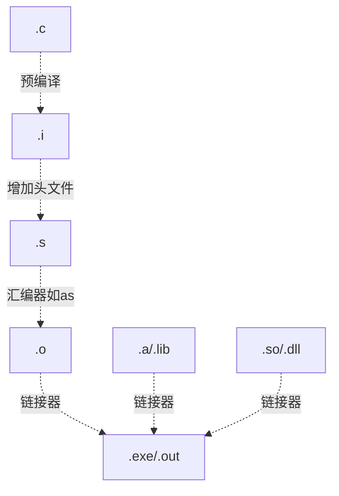
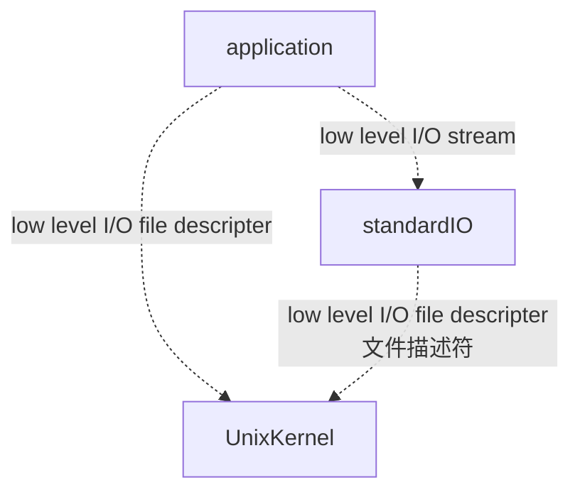

怎么在移动硬盘中安装Linux ubuntu?

linux系统终端里下执行一个***.pl文件

ICCAD 基础, 真是讲linux 的好课. 

### 用户系统

输入命令：**sudo password root**
终端会提示你让你给root用户设置密码，设置新密码后继续确认新密码。

**su root**

输入root用户密码；
**当输入框前面的“$”符号变成“#”时，就可以使用root权限了。**

如果你想返回到普通用户的话，输入命令：su 普通用户名 就可以了

### 文件系统

各个文件夹的内容:

bin (binary)  放着二进制命令 sh  (shell)    data  csh

etc   系统配置文件等  passwd , group

lib(library)库   C语言标准链接库, 共享库文件,给/bin和/sbin下的文件使用

usr(user)  下面有它的bin存放usr下面用的可执行代码,也有man  ,local, local下面还有 bin,man和src(source).

dev(device ) 里面有ttya ,远程终端 , null
tmp(temporary) 
home  用户的主目录，在 Linux 中，每个用户都有一个自己的目录，一般该目录名是以用户的账号命名的

/src 内核源代码默认的放置目录。里面有linux源代码.

/boot  启动文件
/lost +found 失物招领处, 
/misc  杂七杂八的东西
/mnt   mount 安装盘,系统提供该目录是为了让用户临时挂载别的文件系统的，我们可以将光驱挂载在 /mnt/ 上，然后进入该目录就可以查看光驱里的内容了。
/net   可能挂着远程的硬盘
/proc  process进程, 是一种伪文件系统（也即虚拟文件系统），存储的是当前内核运行状态的一系列特殊文件，这个目录是一个虚拟的目录，它是系统内存的映射，我们可以通过直接访问这个目录来获取系统信息。这个目录的内容不在硬盘上而是在内存里，我们也可以直接修改里面的某些文件，比如可以通过下面的命令来屏蔽主机的ping命令，使别人无法ping你的机器：
/opt  option这是给主机额外安装软件所摆放的目录。比如你安装一个ORACLE数据库则就可以放到这个目录下。默认是空的。
/sbin  system binary 系统管理员可以执行的binary
/var variable 变量,这个目录中存放着在不断扩充着的东西，我们习惯将那些经常被修改的目录放在这个目录下。包括各种日志文件。

全路径名从 /   开始, 或者 $HOME/.bashrc  ,也是从slash开始的
/ 这个符号念slash 
echo $HOME就知道了它的路径

相对路径从 dot开始 比如 ../../include/define.h

运行：
./路径/文件名 （加个“./”符号是运行命令）
使用命令行执行某个程序的时候，Linux会到PATH环境变量的路径去搜索程序文件，但在默认情况下，Linux和Windows不同，Windows会搜索当前目录，而Linux不会搜索当前目录.
所以在当前目录下的程序，而当前目录不在PATH环境变量中的话，就需要加上"./"来指定到当前目录下去查找应用程序了。


命名规范

1. Meta characters 客服一般在印度,口音很严重哈哈哈,你要会读这些字符,

2. 鼓励用字母数字和下划线.Unix是case sensitive大小写敏感的

### 目录命令

```bash
pwd 当前目录在哪里
cd = cd~ =cd $HOME   ,直接敲cd就是到$HOME了,
mkdir 创建目录 make directory
rmdir 删除目录remove directory
ls  list 列出所有文件
ls  -al  和ls -la 是一样的  所有的,all,包括以"." 开头的
ls -lt 最近的排前面,根据time排队
ls -R  recursive 递归列出,广度优先
ls -l  long 完整地列出
```

参数可以拼在一起, ls - al,ls -alt, 就是两个参数三个参数.

ls -l 你会看到 

`drwxr-xr-x.  2 root root    6 1月   8 00:08 桌面`

2- 10字符是三组读写执行权限access permission
前三个是user/owner的权限
中三个是group用户组的权限
后三个是others的权限

第二个是number of links ,这里是2 , 第三个是 owner 第四个是group 这里都是root 第五个是size or device number,ls列出大小是**以字节为单位**, 第六个是修改时间 1月 8日 00:08,第七个是file name文件名

```c
- 表示ordinary file 普通文件
d 表示是文件夹, 
-l symbolic link 符号链接
-d 是目录 directory
```
```c
r 读权限, 
w 写权限
x execute 执行权限
- no permission
```
alias al 是默认加了颜色的.
alias ls = " ls --color =auto"

alias rm='rm -i' 取一个别名 默认删除的时候提示.

命令: ctrl+ c 或者ctrl+u取消当前命令

##### 寻找一个文件:

find -name 'XErr*' 

find  -iname se.java  -iname不区分大小写.

示例：① 列出当前目录及子目录下所有文件和文件夹: `find .`；

② 在`/home`目录下查找以.txt 结尾的文件名:`find /home -name "*.txt"` ,忽略大小写: `find /home -iname "*.txt"` ；

③ 当前目录及子目录下查找所有以.txt 和.pdf 结尾的文件:`find . \( -name "*.txt" -o -name "*.pdf" \)`或`find . -name "*.txt" -o -name "*.pdf"`。

参考文献可以看这个

https://www.cnblogs.com/loveyouyou616/p/9796294.html

10月22日

### 文本editor vi的使用

 按下a 键for append after cursor command 进入append mode 和按下i键一样 
gvim可以有可视化的软件.
可以用vimtutor来学习vim的使用
基本操作:

1. 光标在屏幕文本中的移动既可以用箭头键，也可以使用 hjkl 字母键。
         h (左移)       j (下行)       k (上行)     l (右移)

  2. 欲进入 Vim 编辑器(从命令行提示符)，请输入：vim 文件名 <回车>

  3. 欲退出 Vim 编辑器，请输入 <ESC>   :q!   <回车> 放弃所有改动。
                      或者输入 <ESC>   :wq   <回车> 保存改动。
小提示  输入 q: 可以显示历史记录.

  4. 在正常模式下删除光标所在位置的字符，请按： x

  5. 欲插入或添加文本，请输入：

         i   输入欲插入文本   <ESC>             在光标前插入文本
         A   输入欲添加文本   <ESC>             在一行后添加文本
o 可以在这一行下面开一个新行.
大写 A 在最后输入, 大写I 在开始输入.
特别提示：按下 <ESC> 键会带您回到正常模式或者撤消一个不想输入或部分完整
的命令。
好了，第一讲到此结束。下面接下来继续第二讲的内容。

#### 删除:

dw可以删除这个单词
dd 删除当前行
D 从光标删除到这一行最后.
3 x 删除后面三个
3 X 删除前面三个(相当于加快backspace)

合并和改写:
cw  这个word change成别的
c$ 从光标到行最后开始改.
~  改变大小写.
J  合并(join)这一行和下一行.
u undo 相当于ctrl+z     undo错了可以 :redo 或者按句号键 "."
. redo

替换命令: s/word1/word2 substitution
:2,30 s/use/used  /g  2-30行 .参数加个g ,这一行找到的全部换; 没有g ,就替换一行找到的第一个.
:1,$  s/Oct\./Nov .  替换Oct. 换成 Nov.  从第一行到最后一行.

#### 复制粘贴:

y4y   复制下面4行
p   粘贴paste

**全选（高亮显示**）：按esc后，然后ggvG或者ggVG

**全部复制：**按esc后，然后ggyG

**全部删除：**按esc后，然后dG

解析：

**gg：**光标移到首行，在**vim**才有效，vi中无效 

**v ：** 进入Visual(可视）模式 

**G ：**光标移到最后一行 

选中内容以后就可以其他的操作了，比如： 
**d** 删除**选**中内容 
**y** 复制**选**中内容到0号寄存器 
**"+y** 复制**选**中内容到＋寄存器，也就是系统的剪贴板，供其他程序用 

 

#### 跳转查看:

^F forward 下一页,  ^B back 上一页.
^D  down下半页     ^U  up  上半页

逐页显示 testfile 文档内容，如有连续两行以上空白行则以一行空白行显示。

```bash
more -s testfile
```

#### 行内跳转:

$到最后
0到最前 
^ 到第一个文字
e  到这个词末尾

#### 寻找操作:

在命令模式（进入后直接按shift+：）下输入:

f a  移动到下一个字母a
/ pattern string 可以到下一个匹配的字符串.
比如/be  移动到下一个be  ,再按n就可以找到下一个be,大写的N可以往上找.

% 可以找到括号对应的上一个括号.

#### 正则表达式: 分为三部分 REs regular expression

anchors
character sets
modifiers

```
. match any single character except newline
* match 0或多个
[abc]  match a或b或c
[a-d] match 范围内
[^abc]  match (a或b或c)的补集
^exp  表达式必须出现在 行开头
exp$ 必须出现在行末
\  处理下一个character literally
? 问号代表前面的字符最多只可以出现一次（0次、或1次）
```
比如:
```bash
xy*z     一个x,0个或多个y,一个z
^cat    cat出现在开头.
\*         任何*的出现
[cC]at  cat 或Cat
[^a-zA-Z] 所有非alphabetic的character
[0-9]$  所有以数字结尾的line
[A-Z][A-Z]* 一个或多个大写字母
[A-Z]* 零个或多个大写字母
```
##### 几个常用的非贪婪匹配Pattern

- *? 重复任意次，但尽可能少重复
- +? 重复1次或更多次，但尽可能少重复
- ?? 重复0次或1次，但尽可能少重复
- {n,m}? 重复n到m次，但尽可能少重复
- {n,}? 重复n次以上，但尽可能少重复

#### grep提取

```bash
grep test *file 
#在当前目录中，查找后缀有 file 字样的文件中包含 test 字符串的文件，并打印出该字符串的行。
grep test test* #查找前缀有“test”的文件包含“test”字符串的文件
结果如下:
testfile1:This a Linux testfile! #列出testfile1 文件中包含test字符的行  
testfile_2:This is a linux testfile! #列出testfile_2 文件中包含test字符的行  
testfile_2:Linux test #列出testfile_2 文件中包含test字符的行 
```

这是linux比较独特的, 因为window你必须打开它, 然后查找. 

### 命令bash

history nn 打印之前nn条命令

!f  上一条f开头的命令并且显示那时的结果

!! 执行上一条命令

!nn执行之前nn条命令

#### 重定向

bash里面
```bash
>      输出重定向到一个文件或设备 覆盖原来的文件
>!    输出重定向到一个文件或设备 强制覆盖原来的文件
>>!  or  >|   重定向到file
>>     apppend to file
>><   从 file  input 
>>|  pipe output 到另一个命令
>>tee 重复标准输出,流到多个地方
>>ls -l | tee lslist   在屏幕上显示,同时信息流入文件.
>>丢弃输出   > /dev/null  
```
2>errfile 把错误信息定向到文件.


csh里则是多一个&
```bash
>& file  重定向到file
>>& file   apppend to file
>>|&  pipe output 到另一个命令
```
command  &  在后台执行
&&  前面的完成了后执行命令一
||   前面的失败了后执行命令一

'' 单引号中不需要特殊含义,全部视为字符串
"" 双引号中除了$和\取特殊含义,其他都视为字符串

加 & 让他在后台运行
bg  继续运行后台的job

fg  3  控制台 由任务3 占领

^z  暂停
jobs 观察任务

#### 进程

ps -ef  or ps -aux 看整个系统的process status

top 动态查看ps, 
pstree 进程树
uptime tell 系统运行了多久.

#### kill

kill  -l 可以查看kill可以发送的信号.例如 HUP 挂起, INT中断,

kill -9 PID 第9个信号是删除 ,

#### 环境变量

查看 :echo $PATH

修改PATH看这个

https://www.cnblogs.com/hust-chenming/p/4943268.html

##### set global environment variable

export NAME = value

比如export PATH=$PATH:/home/user/scripts

`export PATH=$PATH:.` 最后加一个dot,这样他会到这个文件夹中去找

注意小心复制:/home/user/scripts,粘贴他可能直接执行, 我一下子把所有PATH都删除了.

##### set local shell变量

name = value

不设置的话就是unset


/etc/profile

登入系统读取步骤：

**当登入系统时候获得一个shell进程时，其读取环境设定档有三步 :**

**1.首先读入的是全局环境变量设定档/etc/profile，然后根据其内容读取额外的设定的文档，如 /etc/profile.d和/etc/inputrc**

**2.然后根据不同使用者帐号，去其home目录读取~/.bash_profile，如果读取不了就读取~/.bash_login，这个也读取不了才会读取~/.profile，这三个文档设定基本上是一样的，读取有优先关系**

**3.然后根据用户帐号读取~/.bashrc**

可以在/etc/profile.d 配置开机启动项

##### /etc/和~/.区别：

**/etc/profile，/etc/bashrc 是系统全局环境变量设定**

**~/.profile，~/.bashrc是用户home目录下的私有环境变量设定**

~/.profile与~/.bashrc的区别:

都具有个性化定制功能

**~/.profile可以设定本用户专有的路径，环境变量等，它只在登入的时候执行一次**

**~/.bashrc也是某用户专有设定文档，可以设定路径，命令别名，每次shell script的执行都会使用它一次**


#### 脚本

#! 叫做magic symbol,  写在第一行,设置用哪个shell来执行这个脚本

set a = $<   读键盘

awk '{printf $1}'  剪切出第一列

awk  '{print $4}'| awk -F '"' '{print $2}'   

以空格为分隔符打印第四列,然后,  以" 为分隔符, 打印第二列.

##### sort 命令

sort将文件的每一行作为一个单位，相互比较，比较原则是从首字符向后，依次按ASCII码值进行比较，最后将他们按升序输出。字段之间的分隔符默认是空格,

- -t $'\t'  把tab作为分隔符

- -n 依照数值的大小排序。

- -u,它的作用很简单，就是在输出行中去除重复行。

- -k 3  根据第三列排序.  

  

##### 变量

echo “$HATs” 会报错, 找不到HATs这个变量

所以需要 “${HAT}s” 花括号

最好用双引号定义变量  ,如" $HAT" 避免有空格或者变量名输错的错误.

**shell脚本对空格有严格的规定，赋值语句等号两边不能有空格，而字符串比较，等号两边必须有空格**

赋值时： i=1　　

```bash
　i=$((i+1))          //   =用作赋值时，两边绝对不能有空格
比较时： if [ $a = $b ]   　　// =用作比较判断时，两边必须有空格
```

下面这行代码变量a左右不能加空格.加了会出错

`a='sed -n 1p pingsort_1.txt'`

sed 命令

- -n或--quiet或--silent 仅显示script处理后的结果。
- p ：打印，亦即将某个选择的数据印出。通常 p 会与参数 sed -n 一起运行

`sed "s/.*CONNS([0−9]∗[0−9]∗).*/\1/g"`

1. 使用s/pattern1(pattern2)pattern3/\1/g  的方式， \1 代表提取括号里pattern2的部分

2. (pattern2)的括号是正则表达式里的运算符，要转义，就变成pattern2pattern2

3. 对应于CONNS(6), `CONNS(  的pattern是 .*CONNS( ,  ) 对应pattern是).*`  这样确保默认贪婪的正则匹配不会匹配到下一个括号前的内容

4. 需要提取的括号中的内容，pattern2, 使用[0-9a-zA-Z]*的方式，我在aix上的sed不支持\w, \d这样的写法

##### 条件语句

if condition

if -f 当存在并且是普通file的话.为真

if -d 当存在并且是directory的话.为真

test 10 -lt 5  测试是否10<5

test有个别名, 左方括号 '['   , 必须和 ']' 配对

  '[' 是一个命令,必须要有空格 和别的隔开  ']'也是.

[ -r "$HAT" -a -s "$HAT" ]

-a 表示 与逻辑,  -s 表示长度大于0  -r表示可读

-o 或逻辑, 

未预期的符号“elif”附近有语法错误

Solution : 我都加了then,加了then好像就可以了

##### 截取

cut  文件内容查看

显示行中的指定部分，删除文件中指定字段

显示文件的内容，类似于type命令。

```bash
-d：指定字段的分隔符，默认的字段分隔符为“TAB”；

-f：显示指定字段的内容；
```

```shell
将内容输出到/home/test文件中
# head -n 10 /etc/profile >>/home/test
# tail  -n 5 /etc/profile>>/home/test
```

##### cron命令

定时执行脚本

"0 12  * * * ?" 每天中午12点触发

"15 10 * * *" 每天上午10:15触发

` 22 22 * * * /home/lustre/hw2/prb4.sh `

22点22分执行prb4.sh

#### meta character   元字符的读音

 backticks (`) 

 vertical bar/pipe symbol ("|");  或者 Alternation  (|);

ampersand ("&");

tilde ("~")

 period/full stop/dot (".");

wildcard character或者 asterisk  (*) ;

backslash \ ;

slash / ;

 caret ("^"); 

dollar sign ("$");

question mark ("?");   plus sign ("+"); 

 opening and closing square brackets ("[" and "]"); 

opening and closing curly brackets/braces ("{" and "}"); and opening and closing parentheses ("(" and ")").

double quotation marks   ""

single quotation marks (' ')

### 网络

你们学过计算机文化吧? 学过网络吗? 以后会学吗?

不学.

示波器检测网线

有变化,就是物理层

但是 10 10 看不到,可能FM高频是1 ,可能PM相位90°是 1 .

| OSI 七层                                                     |
| ------------------------------------------------------------ |
| Application 应用层http,ftp                                   |
| Presentation(五层合并到应用层)表示层                         |
| Session 会话层(五层合并到应用层)                             |
| Transport  传输层  TCP,UDP 等                                |
| NetWork 网络层 IP                                            |
| Data/Link   有以太网 CSMA -CD  或token ring 令牌(用在数据量非常大的地方) |
| Physical(四层合并到数据链路层)                               |

#### 一些名词:

LAN 局域网  WAN 广域网  wide area network

Wi-Fi 的英文全称为wireless fidelity

DNS :  domain name server  应用层         INS: servers provider

PPP   数据链路层, PPPoE:  Point-to-Point Protocol over Ethernet

PPPoE 是一种网络协议，它派生自另一种称为 PPP 的较旧协议，

PPPoE 设计用于管理如何通过以太网网络（有线网络）传输数据，它允许使用以太网在多个客户端之间分配单个服务器连接。因此，多个客户端可以从 Internet 服务提供商连接到同一服务器，并同时访问 Internet。


window跟Linux之间的文件互传，工具有很多。用File-zilla连接服务器。用scp 也行

/etc/resolv.conf 文件中有自己的IP地址.

/etc/nesswitch.conf 文件中 ,有host 解析IP地址找的顺序,一般是file 之后dns 

ip, ipconfig, route , netstat 展示网络状态. 

- - 查看当前系统的网卡信息：ifconfig
  - 查看与某台机器的连接情况：ping
  - 查看当前系统的端口使用：netstat -an  .netstat可以看 pid, 哪个进程用 什么ip地址和端口, 以及用什么协议tcp, 

```bash
ftp host
telnet
上面的都不加密的,明文传播
rlogin/rsh

scp 是 linux 系统下基于 ssh 登陆进行安全的远程文件拷贝命令。scp 是加密的，rcp 是不加密的，scp 是 rcp 的加强版。
rcp/scp
我可以试试用我的电脑scp myfile Alicloud@100.100.2.136:/home/root/others/
例子如下: 
scp /home/space/music/1.mp3 root@www.runoob.com:/home/root/others/music 
scp /home/space/music/1.mp3 root@www.runoob.com:/home/root/others/music/001.mp3 
scp /home/space/music/1.mp3 www.runoob.com:/home/root/others/music 
scp /home/space/music/1.mp3 www.runoob.com:/home/root/others/music/001.mp3 

curl
wget
lynx/links
ssh [-l username] hostname [command]
格式也有 hostname:file
例如git@github.com:michaelliao/gitskills.git
就是用户名@host.domain域名:文件
```

可以用ssh连接别人的电脑


#### ftp命令 

　　使用格式：ftp [-v] [-d] [-i] [-n] [-g] [-s:filename] [-a] [-w:windowsize] [computer]

　　　　-v：禁止显示远程服务器响应信息

　　　　**-n：禁止自动登录**

　　　　-i：多文件传输过程中关闭交互提示

　　　　-d：启用调试，显示所有客户端与服务器端传递的命令

　　　　-g：禁用文件名通配符，允许在本地文件和路径名中使用

```bash
先输入ftp ,回车, 进入ftp状态
然后输入下面这些命令
-nlv 作为参数
help 帮助
•cd  /  lcd (two sides: C/S)lcd 客户端,ftp的内建命令。代表 change local directory——切换本地目录
cd 服务器端切换
mget 获得多个文件
mput 上传多个文件
verbose 发送多个信息
bye/quit 退出

# ---- 感叹号之后的都是ftp命令-----
ftp -n<<!
open speedtest.tele2.net 
anonymous   #第一次登录用 , 连接上之后要用user anonymous 
0 没有密码
quote PASV
试试用以被动模式连接。
一般DOS命令行下都是默认以PORT主动模式连接。
即:端口21监听，处理控制信息，再以端口20连接客户端进行数据传送。而经常的通过外网的NAT的，基本端口20的数据连接都会被禁止掉。PASV被动模式:以端口21监听，有连接请求时，随机开放一个比较大的端口号来处理数据传输。
binary  # Switching to Binary mode.
prompt #原来每上传一个文件都输入一下y来确认，没有时间进行这样搞，需要在命令模式，并登录系统后用prompt来关闭它：
get 1KB.zip
close
bye
!
# ---- 感叹号之内的都是ftp命令-----
!ls  #退到本地shell
```

unix上的http 服务器软件是 Apache HTTP Server(httpd)

相比于[HTTP](https://baike.baidu.com/item/HTTP/243074)，FTP协议要复杂得多。复杂的原因，是因为FTP协议要用到两个[TCP](https://baike.baidu.com/item/TCP/33012)连接，一个是[命令](https://baike.baidu.com/item/命令/13020279)链路，用来在FTP[客户端](https://baike.baidu.com/item/客户端/101081)与[服务器](https://baike.baidu.com/item/服务器/100571)之间传递命令；另一个是[数据链路](https://baike.baidu.com/item/数据链路)，用来[上传](https://baike.baidu.com/item/上传/749624)或[下载](https://baike.baidu.com/item/下载/2270927)数据。


mail的发送协议是 SMTP,  接收协议 是POP3 和IMAP Internet Message Access Protocol应用层

#### SSH 协议

安全外壳协议。为 Secure Shell 的缩写。SSH 为建立在应用层和传输层基础上的安全协议。

**sshd命令**是openssh软件套件中的服务器守护进程。

1. 检查是否启动 ` ps -e | grep ssh`

2. 连接1234 端口`ssh -p 1234 ldz@192.168.0.1`

3. 将 文件/文件夹 从本地拷至远程 Ubuntu 机(scp)
   `$scp -r localfile.txt username@192.168.0.1:/home/username/`

- -r： 递归复制整个目录。
- -P 1234 [fileUrl] [user]@[ip]:/home 指定port

那么这个本地文件在哪里有没有关系呢? 有关系,你要先进入本地目录,然后打开终端.

```
scp -P 1234 -r test user@192.168.0.101:/home/data
1
```

将该路径下的test文件夹上传到服务器的`/home/data`

4. 将 文件/文件夹 从远程 Ubuntu 机拷至本地(scp)
   `$scp -r username@192.168.0.1:/home/username/remotefile.txt`

   
   

### 系统管理

#### 管理员

su 就是进入superuser状态 , su username 切换到另一个用户

sudo 就是用superuser状态做一条命令. 比较安全.

#### 硬盘模型

Disks mount  to positions in file tree,  mount有骑上,载上的意思
a disk partition 分 3个major sections
superblock
inodes  索引节点
data blocks 

##### superblock 

在内存里会有个copy,  需要sync 命令, 把内存的东西写入硬盘然后update superblock,它是[硬盘分区](https://baike.baidu.com/item/硬盘分区/300753)开头——开头的第一个byte是byte 0，从 byte 1024开始往后的一部分数据。由于 block size最小是 1024[ bytes](https://baike.baidu.com/item/ bytes/6743146)，所以super block可能是在block 1中（此时block 的大小正好是 1024 bytes），也可能是在block 0中。 超级块中的数据其实就是文件卷的控制信息部分，也可以说它是卷资源表，有关文件卷的大部分信息都保存在这里。例如：硬盘分区中每个block的大小、硬盘分区上一共有多少个block group、以及每个block group中有多少个[inode](https://baike.baidu.com/item/inode/16194)。

##### Inode

所有的文件和文件夹都有一个Inode, 记录文件的metadata元信息如size, permission, data address(因为一个文件可能被分成几块放在不同地方). 

`stat a.txt` 可以看a.txt的inode信息 

inode 有data block 的地址, 

cat  的全称是concatenate使(成串地)连结[衔接]起来 ,深度优先搜索data block

同学们后面学计算机体系结构?不学.

很多同学主要做cache , 人工智能卷积和放进cache

修复文件系统. 

 **fsck** -y -a -n filesystem

-y -a   对所有问题说yes

-n 对所有问题说no

看磁盘使用情况:disk free 

**df** ：  -i  -k  显示空闲的disk block. -k 就是用kb显示大小 .

cat一个文件, 找到inode指向地址的数据块

ls 一个文件, 得到inode.

#### 管理文件系统

最小设置

root 

swap区

增加系统 mount

create a mount point挂载点    /home 

mount the file system

```bash
mount /dev/sdc1  /home 
```

sdc1 是一个硬盘

umount 解除挂载

**du** 报告目录所有的数据块disk usage ,可以看还有多少空间

du /home 

du -ks file

-k  kilotypes作为单位,  -s只显示total sum

可以练习USB盘安装试试

tar  压缩tape archive 

```bash
tar cvf bug.tar /usr/share/bug  就是create verbose啰嗦的file
tar tvf bug.tar 查看tar
tar xvf bug.tar 
```

linux 脚本化, 实现自动打包发送

#### NFS

cshell, vi , NFS  网络文件系统，英文Network File System(NFS)，是由SUN公司研制的UNIX表示层协议(presentation layer protocol)，都是bill joe 写的.

```bash
# mount -t nfs cello:/remotedir /project
远程挂载cello硬盘上/remotedir目录
对方:
cat /etc/exports 
share -F nfs /space
```

#### NIS network information system

应用场景: 美国的人来中国上班, 要系统的用户密码, 界面也要一样.

把这些信息存在NIS中,

##### linux打印

lp  , lpq , lprm, lpstat

##### Using FLEXIm 

export license文件

买软件,需要一个service id

我们发给她mac地址, 她发给你.

### Xwindow

具体实现看这个https://www.cnblogs.com/tsfh/p/9022170.html

X是一个**协议**并不是具体的实现，类似HTTP，WSGI一样都是协议，X11就是X协议的第11版，类似ES5，ES6等不同版本的ECMAScript标准。 X protocol 在TCP/IP上层.

X协议中, X应用程序负责通过X协议告诉服务端需要在服务端显示什么图形，然后服务端收到消息后就会通过服务端上的Xserver的实现来显示客户端程序想要的图形。

X11 released in 1987    怎么让电脑的屏幕,显示到手机上?怎么在不同计算机之间传递图形?

X Features  : 

- 独立于architecture and OS, 共享graphics.

- programs running anywhere in a network can display on any workstation 
- 不同的app 可以显示在同一手机屏幕(当时没有,双屏实现了)

另一个教室的人听到通知, 把老师的线画到另一个教室的黑板上

X display server 就是另一个教室的人, 她管理黑板, 老师就是X client

#### Events

34种事件, 

client 有一个mask, 设置接收哪些事件

window exposure, server 内存很小, 不负责redraw内容, 发送window exposure信号给client

#### 命令

```bash
Xset q #query your display

Xterm #打开一个X terminal

xhost + machineb  #就允许b机器作为client 
ssh -X/-Y machineA 

```

为了安全, secured tunnel ,  老师在教室有一个virtual X server, virtual X server和另一个教室的人ssh加密通信. 有一个小练习. 


#### X Emulator仿真器 on PC

开发库 ,安装 libx11-dev 

main loop {

 XNextEvent()

handleevent(&event) ; // 自己写. 

}

#### 编写 X app

A initialization  

1. 包含头文件
2. 建立连接. 

B. event management

1. tell server 要听什么vent 
2. event loop

C termination

1. destory resources
2. close display
3. exit

### 软件开发工具 Software development tools

Richard Stallman  ,GNU计划以及自由软件基金会（Free Software Foundation）的创立者发明了gcc.他所写作的GNU通用公共许可证（[GPL](https://baike.baidu.com/item/GPL)）是世上最广为采用的自由软件许可证.gcc ,  以前用cc, sun机器买cc要上万美元.


也可以用flow来画图
```flow

op=>operation: .c文件
op2=>operation: .o文件
cond=>condition: Yes or No?
e=>end
op->op2
cond(yes)->e
cond(no)->op
```

#### gcc命令

 -c 只编译  生成 .o文件

-g 编译并debug

-O? 比如-O1  for 优化等级

-o output_filename(如hello) hello.o或hello.c ( .c的编译和链接一起或者只链接.o )  不加-o默认可执行文件名字是a.out

-I pathname 大写的i,不是l,增加引用的文件夹 to include and #include for search file

-D sysmbol 定义预处理symbol ,等价于  #define symbol

-L directory 增加link引用的文件夹 for search file

-lxyz  具体 link with 库 libxyz.a or  libxyz.so 

-M 把所有依赖都列出来

-s 生成汇编语言.

代码中用到了exp函数，它位于数学库libm.so或者libm.a中，因此编译时需要加上-lm。**如果使用到的函数没有在libc库中，那么你就需要指定要链接的库**，本文中需要链接libm.so或libm.a

```bash
gcc -o main main.o -lm  #编译成最终的可执行文件,名字为main
```

后缀 .pl perl script     .a  静态库   .so  shared object共享库dll      .scala 替代verilog

可以直接 `gcc hello.c` 编译和链接一起,产生a.out文件

`ranlib -generate index to archive`

```bash
ar crv libhello.a hello.o #将目标文件hello.o 打包成静态库文件libhello.a。
```

还拿hello.c来说，使用下面的命令就可以生成一个动态库文件libhello.so 。看一下各个参数的含义。
```bash
 gcc -fPIC -shared -o libhello.so hello.c
```
-fPIC 是创建与地址无关的编译程序（pic，position independent code），是为了能够在多个应用程序间共享。-shared指定生成动态链接库。
reference：https://zhuanlan.zhihu.com/p/307640255

#### 源代码 debugging

gdb from GNU/ddd with GUI

gdb tri

gdb br 8 第八行加断点

gdb  run 

gdb  print value

**其他tools**

as # 汇编器
lex  词法分析(GNU:flex) 关键词发现,例如注释

yacc  语法分析(GNU: bison)

#### makefile

参考http://www.ruanyifeng.com/blog/2015/02/make.html

##### 意义:

1.对于简单代码还好，而对于大型项目，具有成千上万代码来说，仅用一行规则是完全不够的，即使够的话也需要写很长的一条规则；
2.任何文件只要稍微做了修改就需要整个项目完整的重要编译。

##### 用法

target:  dependencies... (只要有依赖比target新, 就执行命令)

​	commands...

macros 简化写法,类似于变量

```makefile
OBJS=srcfile1.o srcfile1.o srcfile1.o

myapp1: $(OBJS)  #括号不能少
	gcc -o myapp1 $(OBJS) -lm 
srcfile1.o: srcfile1.c myncld.h
	gcc -o 
srcfile2.o: srcfile2.c myncld.h
```

predefined macros预定义宏 ,  `make -p`可以查看

make -n 不执行,预览一下Prints commands, but does not execute them.

Makefile文件也可以写为makefile， 或者用命令行参数指定为其他文件名。

> ```bash
> $ make -f rules.txt
> # 或者
> $ make --file=rules.txt
> ```

上面代码指定make命令依据rules.txt文件中的规则，进行构建。


##### special internal macros

$* the basename of the current target 也就是target除了后缀的名字

$< 依赖文件的名字, 可以触发规则 

$@ the name of the current target  . target的整个名字

$? 列出比target新的依赖文件

```makefile
.SUFFIXES: .c .f
.c.o: 
$(CC) $(CFLAGS) -c $<
.f.o: 
$(FC) $(FFLAGS) -c $<
#Predefined rules used by make ($< stands for the file that triggered the rule, i.e. the .c or .f file here)

#根据makefile, 首先我们可以画一个依赖图
LIB = -L /usr/lib/x86_64-linux-gnu    -lX11 -lm  
INC = -I /usr/include/X11 –I ./include 
INCFILE = all.h draw.h global.h
SOURCE = main.c init.c readline.c toview.c translate.c \    
cast.c drawline.c draw_guide.c
# 最后那个backslash '\' 取消换行的特殊含义.在下一行继续写
OBJ = $(SOURCE:%.c=%.o)   #把source中所有.c换成.o
draw:$(OBJ)  
	gcc    –g $(OBJ) $(LIB) –o $@
%.o:%.c    # 把所有.o换成.c
	gcc    –g  –c $(INC) $< -o $@
clean:   
	rm   –f *.o 
	rm draw
```

用法  make 看到第一个target是谁就是谁,  make draw 也可以,  最后make clean

使用指令"touch"修改文件"testfile"的时间属性为当前系统时间，输入如下命令：

```bash
$ touch testfile                #修改文件的时间属性 
```

non-make 的build工具 :谷歌公司的 bazel,微软的M$build等

希望进一步学习,可以看看下面复杂的makefile

```makefile
SHELL       = /bin/sh 
TOP         = ../.. 
# Tool path  
Opc_INC     = $(TOP)/opc/inc 
Opcfs_INC   = $(TOP)/opcfs/inc 
Model_INC   = $(TOP)/model/inc 
My_INC      = ../inc 
My_LIB      = ../lib 
#  Support environment 
X_INC       = . 
Tk_INC      = /usr/local/include 
# TargetTARGET  = ../bin/d_litho 
LIBRARY = ../lib/liblitho.a 
SOURCES =   tr100s.c zschur.c runlitho.c spec.c \cal_gauge.c t2w.c bkernel.c w2t.c \ linear_regression.c \ multi_linear_regression.c \ setpara.c gaussian.c switchTCC.c OBJECTS = $(SOURCES:%.c=%.o) 
MAINOBJ = main.o
#  Compilation MACROs 
DEFINES     = -DXTFUNCPROTO -DSOLARIS
CFLAGS      = -O3   -msupersparc 
INCFLAGS    = -I$(My_INC) -I$(Opc_INC) -I$(Opcfs_INC) \ -I$(Model_INC) 
EXT_LIBS    = -lstdc++ -lm  
# Rule definition 
CC          = gcc $(CFLAGS) 
CXX         = gcc $(CFLAGS) .PRECIOUS: $(LIBRARY) .SUFFIXES: .c .cc .cpp .cxx .c.o: @echo "Compiling $< ... \\c"  @$(CC) -c $(DEFINES) $(INCFLAGS) $< @echo done .cc.o: 
@echo "Compiling $< ... \\c"  @$(CXX) -c $(DEFINES) $(INCFLAGS) $< 
@echo done 

#  Make installation  就可以执行
install:: @echo "Making $@ with $(CFLAGS) $(DEFINES) option, \please wait..." 
install:: $(TARGET) $(LIBRARY) 

$(TARGET): $(LIBRARY) $(MAINOBJ) 
	@$(CC) -o $@ $(MAINOBJ) $(LIBRARY) $(EXT_LIBS) 
	@echo done 
purify: #purify是一个昂贵的付费软件, 可以检查c语言有没有动态错误,用一个容器查exception
	@purify $(CC) -o $(TARGET) $(MAINOBJ) $(LIBRARY) $(EXT_LIBS) @echo done 
$(LIBRARY): $(OBJECTS) 
	@ar rl $@ $?; ranlib $@ 
	@echo done 
	
	#  Make debug   cflag改了
	debug: @make install CFLAGS="-g  -DDEBUG " -f Makefile 
	# source file dependence
%.d: %.c
	$(SHELL) -ec 'gcc -M $(CPPFLAGS) $(DEFINES) \      #把所有相关的文件都列出来
	$(INCFLAGS) $< | sed '\''s/$*\\.o/& $@/g'\'' > $@' %.d: %.cc 
	$(SHELL) -ec 'gcc -M $(CPPFLAGS) $(DEFINES) \      
	$(INCFLAGS) $< | sed '\''s/$*\\.o/& $@/g'\'' > $@' 
	......  (略去)
	include $(OBJECTS:.o=.d) 
```

##### 问题: 

makefile：4：***缺少分隔符。停止

你应该总是在“tab”之后写命令而不是空格。这个是很典型的错误，makfile的命令行是需要tab开始的， 相当于tab键告诉make 这一行是命令行。

解决方法: 只要在gcc前面加上tab就不会有错误了。


### 版本控制工具

2007年, Linus Benedict Torvalds 创造了git 

除了intel都是big endian ,0x1234 高位地址对应0x34, intel是little endian. 高位地址对应0x12.


### C语言

#### Typical Memory Layout

| 命令行 和环境变量                |
| -------------------------------- |
| stack                            |
| heap                             |
| data (可读可写)                  |
| text (code和constants,read only) |



低等级I/O 

open close Iseek read write 

process table entry  -> file table  -映射> vnode ->  inode table


每一个文件描述符会与一个打开文件相对应，同时，不同的文件描述符也会指向同一个文件。相同的文件可以被不同的进程打开也可以在同一个进程中被多次打开。系统为每一个进程维护了一个文件描述符表，该表的值都是从0开始的，所以在不同的进程中你会看到相同的文件描述符，这种情况下相同文件描述符有可能指向同一个文件，也有可能指向不同的文件。具体情况要具体分析，要理解具体其概况如何，需要查看由内核维护的3个数据结构。

当[进程](https://www.computerhope.com/jargon/p/process.htm)成功请求打开文件时，内核将返回一个文件描述符，该描述符指向内核的全局文件表中的条目。文件表条目包含文件的[inode、](https://www.computerhope.com/jargon/i/inode.htm)字节[偏移量](https://www.computerhope.com/jargon/o/offset.htm)以及该数据[流的访问限制](https://www.computerhope.com/jargon/d/datastre.htm)（[只读、](https://www.computerhope.com/jargon/r/readonly.htm)只写等）等信息。


### Unix system calls

展示系统错误perror()

#### file system calls : 

open( ), lseek( ), read( ), write( ),

 close( ), chdir( ), chroot( ), chown( ),

 chmod( ), stat( ), fstat( ) 

mount( ),  umount( ), link( ),

 unlink( ) ,pipe( ), mknod(), dup( ) 

#### process control calls: 

fork()子进程是父进程的副本，它将获得父进程数据空间、堆、栈等资源的副本。注意，子进程持有的是上述存储空间的“副本”，这意味着父子进程间不共享这些存储空间。

UNIX将复制父进程的[地址空间](https://baike.baidu.com/item/地址空间)内容给子进程，因此，子进程有了独立的地址空间。在不同的UNIX (Like)系统下，我们无法确定fork之后是子进程先运行还是父进程先运行，这依赖于系统的实现。所以在移植代码的时候我们不应该对此作出任何的假设。, kill( ), signal( ), execve(), 

wait(), exit(), sleep(), nice(), pause(), 

setuid( ), setgid( ),

 setpgrp( ), 

time( ), stime( ), times( ), alarm( ) 


调用fork()的时候, 出来两份process.如今硬件软件都已经发展的足够好了，用CreateProcess没什么不好，哪怕pthread也比fork要先进的多。fork对多任务其实不友好。只是因为它太古老了，支持的操作系统多。作为对比，这个东西就像printf一样，古老，但不一定多好用，比它们强大的API多的是，只不过兼容性不好，行为不好控制而已。

#### Inter-Process Communication (IPC)

1. 管道Pipe –pipe(), mknod()**mknod命令**用于创建Linux中的字符设备文件和块设备文件。, read(), write() 
2. 信号Interrupt and signal–kill(), signal(), setjmp(), longjmp() setjmp()进行非局部标号的设置，而longjmp()是实现跳转的功能，调转到设置的标号处setjmp()。
3. 消息队列Message queue –msgget(), msgctl(), msgsnd(), msgrcv() 
4. Semaphore信号量–semget(), semop(), semctl() 
5. 共享内存Shared memory –shmget()当key的取值为IPC_PRIVATE，则函数shmget()将创建一块新的共享内存, shmat(), shmdt()shmdt将使相关shmid_ds结构中的shm_nattch计数器值减1, shmctl()  删除共享内存.
6. Socket用到的一些函数有–socket(), bind(), getsockname(), connect(), listen(), accept(), send(), 

recv( )不论是客户还是服务器应用程序都用recv函数从TCP连接的另一端接收数据。该函数的第一个参数指定接收端套接字描述符；, shutdown() 

**进程间可以通讯, 考试可能问一问.**


### More on 脚本语言

Large, complex applications:

-  Performance important. 

- Need structure. 

- Goal: prevent bad things.

interactive commands ,script : 

- performance less important

- Minimum structure: less overhead, easy interchange.

- Goal: enable good things.

#### Tcl/Tk Overview

数字 IC 设计工程师使用的工具无论前端还是后端，应该大部分是支持 Tcl 做为交互语言的；而模拟 IC 工程师可能少一点，但也能找到那么一两个支持 Tcl 的。

Component technologies:

- Tcl: embeddable scripting language

- Tk: GUI toolkit and widgets based on Tcl ,python也可以import Tk.

Results: 

- Raise the level of X programming: simpler, 5-10x  faster application development.

- Greater power: more things programmable, applications work together.

#### More on the Tcl Language 

•Rich set of built-

in commands:

Variables, associative arrays, lists.

C-  like expressions.

Conditionals, looping:

```tcl
if "$x < 3" {

puts "x is too small"

} 
```

```tcl
Factorial Procedure 
proc fac x {
 if $x<=1 {return 1}
expr $x*[fac [expr $x-1]]
} 
fac 4 ⇒ 24 
```

#### The Tk Toolkit

•Solve the problem:

Problem: too hard to build applications with nice user interfaces.

"C++, object-oriented toolkits" vs. "creating interfaces by writing 

Tcl scripts" 

•Additional Tcl commands: 

Create/arrange widgets.

Bind events to Tcl commands. 

Manipulate X selection, focus, window manager, etc.

•Library of C procedures: 

Create new widget classes.

Create new geometry managers. 

#### wish -  Windowing Shell for Tcl/TK

•Create user interfaces by writing Tcl scripts

•Hello, world: 

```tcl
button .hello -text "Hello, world" -command exit
pack .hello
```

•Simple directory browser: 30 lines

•Web browser: 2000 lines, 10x less code for simple things.

```tcl
#!/  usr/local/bin/wish  
有一个listbox,名字叫.list , y方向的scroll
listbox .list -yscroll \ 
".scroll set"  -width 20 -height 20
.list放在左边
pack .list -side left

scrollbar .scroll -command \ ".list yview"
scrollbar放在右边  -fill代表充满
pack .scroll -side right -fill y

设变量dir为 ,argv是一个数组, argc是一个int.取出argv[0].bash中没有数组, 你可以shift遍历,
if {$argc > 0} {
   set dir [lindex $argv 0]
} else {
   set dir .
}
执行ls的结果每一行, inster到.list的end,因为有-a,还会显示.. 和... 这样你可以点击来进入上一层.
foreach i [exec ls $dir –a] {   
   .list insert end "$i"
} 
-1是左键, -2是右键, 左键双击,则调用browse 把当前点击区域的名字获得
bind .list <Double-ButtonPress-1> {    
   browse $dir [selection get]
} 
按下ctrl+c就
bind all <Control-c> {destroy .}

proc browse {dir file} {
   if {$dir != "."} {
	  set file $dir/$file
   } 
   if [file isdirectory $file] {
相当于bash中的if -d
递归自己,创建窗口 ampersand&的意思是在后台运行. 
       exec browse.tcl $file &
   } else {
       if [file isfile $file] {
       exec gvim $file &
       gVim是Vim的图形前端，它是跨平台的编辑器
   } else {
   error "can't browse $file"
   } 
   } 
} 
```


版图显示不是用tcl/tk写的,一层版图占用几十个GB的空间.要用特别考虑performance的C语言写.

没人写tcl的中文文档了,没啥人做, 字幕组多的很. 

#### Python Overview

•An open source, high-level, general

-purposed, interpreted, dynamic programming language

•Better readability and fewer lines of code

•Combined 

object oriented, procedural, functional 

•Rich sets of libraries

•One of the most popular scripting languages in recent years

#### scala 编译在JVM运行

A powerful and popular language, combined 

很多都可以重载重用,object oriented, functional

•Compiled to run on Java Virtual Machine (JVM)

•Specifically developed as a base for domain

specific application programming languages

**Chisel**,  the Scala embedded language for circuit hardware 

constructing .希望替换verilog

•Try to run demonstration code from course ftp site

#### Perl

强在字符串处理.Perl的正则是内置在其语言本身当中的。Perl中有一系列专用的正则运算符，例如，=~、!~、m//、s//……

scalar 变量, 也就是标量 ,$表示是个标量.

```perl
$priority = 9; 

$priority = 'high';

$priority = '9'; 

$default = '0009';
```

vector 向量,多个变量,用@来表示.  

And for strings Perl has the following among others: 

```perl
$a = $b . $c; # Concatenate $b and $c

$a = $b x $c; # $b repeated $c times
```

```perl
$num = 42;  

$string = "The " . $num . " ultimate" . " answer";  

## $string is now "The 42 ultimate answer" 
```

The lc("Hello") operator returns the all lower-case version "hello", and uc("Hello") returns the all upper-case version "HELLO".

```perl
@array = (1, 2, "hello"); ## a 3 element array  

@empty = ();      ## the array with 0 element 

$x = 1;  

$y = 2;  

@nums = ($x + $y, $x - $y); 

@food = ("apples", "pears", "eels"); 
@music = ("whistle", "flute"); 

```

$food[2]  可以返回eels鳗鱼饭

```perl
Equivalent assignments 可以替换
@moremusic = ("organ", @music, "harp");
@moremusic = ("organ", "whistle", "flute", "harp");
•Adding elements to the end of the array,
push(@food, "eggs");
push(@food, "eggs", "lard");
push(@food, ("eggs", "lard"));
push(@food, @morefood);
```

Operating at the "front" ($array[0]) end of the array, -in contrast to push/pop pair

–shift(array) --    returns the frontmost element and removes it from the 

array. Can be used in a loop to gradually remove and examine all the elements in an array left to right. Operator foreach can do that, too.

–unshift(array, elem)

inserts an element at the front of the array. Opposite of shift. 

•splice(array, index, length, array2) 

--    removes the section of the array defined by index and length, and replaces that section with the elements from array2.

可以只删除, If array2 is omitted, splice() simply deletes. For example, to delete the element at index $i from an array, use splice(@array, $i, 1).

##### 文件处理

```perl
open(INFO, $file); # Open for input
打开文件,INFO类似于C语言中的fp,是一个file handler
open(INFO, ">$file"); # Open for output

open(INFO, ">>$file"); # Open for appending

open(INFO, "<$file"); # Also open for input
```

```perl
open(INFO, '-'); # Open standard input

open(INFO, '>-'); # Open standard output
```

```perl
$line = <STDIN>;## read one line from the STDIN file handle
$line2 = <FILE2>;## read one line from the FILE2 file handle 
## which must have been opened previously

chomp($line) # remove the trailing "\n" if present.
```

```perl
open(F1, "ls -l |");## open a pipe to read from a ls process 

open(F2, "| mail $addr");## open a pipe to write to a mail process 
```

Open returns undef on failure, so the following phrase is often 

to exit if a file can't be opened. The die operator prints an error 

message and terminates the program.  前面不成功则die报错

```perl
open(FILE, $fname) || die "Could not open $fname\n";
```

perl怎么获得args?考试可能考.

```perl
foreach $a (@ARGV)

{ print "$a \n";

} 

my $n = @ARGV; #是一个数组.  让标量= 向量就是向量的长度
#（1）my和local都只在一个block里有效，出去就失效；
#（2）但是local的变量可以继续在这个block中调用的子程序中存在；
#（3）如果有与外界同名的变量，两者在block退出后都不影响外界同名变量；
```


```bash
for args in $@

do	ping 5 times #考试可能会考 shell怎么拿到args

​	ping -c 5 $args 
```

##### 正则

```perl
例子一"12121x2121x2" =~ m/^(1x?2)+$/ ==> TRUE  
# +  --    1 or more occurrences of the pattern to its left 
#1x?2 就是 12 或者1x2是否出现一次或多次, 
# ^   -- matches the start of the string 
例子二  "Easy does it" =~ m/^\w+ \s+ \w+ \s+\  w+$/ ==> true
# \w+  表示字母或数字出现一次或多次, 匹配Easy, \s+ 表示空格出现一次或多次, 
例子三:
"bill.gates@microsoft.com" =~ m/^(\w| \.)+@(\w| \.)+$/ ==> TRUE (bill.gates@microsoft.com) 
例子四
"bill.gates@microsoft.com" =~ m/\w+@  \w+/ ==> TRUE (gates@microsoft) 
例子五 :
"bill.gates_emporer@microsoft.com" =~ m/^[\w._  -]+@[\w._  -]+$/ ==> TRUE
例子六:
"Klaatu,   barada,nikto" =~ m/^\w+(,\s*\w+)*$/ ==> TRUE
(,\s*\w+) 就匹配逗号,空格, (,\s*\w+)* 说()里的东西出现零次或多次.
```

##### substitution

`s/[:;#]//g ` 把[:;#]给删除

1.@_ 是函数传参时放置参数的数组，可以从中取实参，
比如 my($para1,$para2...)=@_, 函数调用时填了几个参数，便可以从该数组中取到几个参数。
2.$_ 是默认参数的意思，指的是在不指定的情况下，程序处理的上一个变量，比如
open(IN,"<file.txt")
while(<IN>)
{
print $_;
}
close(IN);
这个例子是打开一个文本


&def_proc();   &开头来调用子程序

